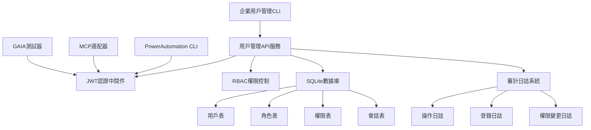

# PowerAutomation企業級用戶管理系統MVP設計

## 🎯 **MVP目標**

在1週內實現PowerAutomation的企業級用戶管理系統最小可行產品，解決當前安全合規和企業採用的關鍵問題。

## 🏗️ **MVP架構設計**

### 📊 **系統架構圖**



### 🔧 **核心組件**

#### 1. **用戶管理API服務** (`enterprise_user_mgmt_api.py`)
```python
from flask import Flask, request, jsonify
from flask_jwt_extended import JWTManager, create_access_token, jwt_required, get_jwt_identity
import sqlite3
import bcrypt
from datetime import datetime, timedelta

class EnterpriseUserMgmtAPI:
    """企業級用戶管理API服務"""
    
    def __init__(self):
        self.app = Flask(__name__)
        self.app.config['JWT_SECRET_KEY'] = 'your-secret-key'  # 生產環境需要更安全的密鑰
        self.jwt = JWTManager(self.app)
        self.init_database()
        self.setup_routes()
    
    def init_database(self):
        """初始化數據庫"""
        conn = sqlite3.connect('enterprise_users.db')
        cursor = conn.cursor()
        
        # 用戶表
        cursor.execute('''
            CREATE TABLE IF NOT EXISTS users (
                id INTEGER PRIMARY KEY AUTOINCREMENT,
                username VARCHAR(50) UNIQUE NOT NULL,
                email VARCHAR(100) UNIQUE NOT NULL,
                password_hash VARCHAR(255) NOT NULL,
                full_name VARCHAR(100),
                department VARCHAR(50),
                role_id INTEGER,
                is_active BOOLEAN DEFAULT 1,
                created_at TIMESTAMP DEFAULT CURRENT_TIMESTAMP,
                updated_at TIMESTAMP DEFAULT CURRENT_TIMESTAMP,
                last_login TIMESTAMP,
                FOREIGN KEY (role_id) REFERENCES roles (id)
            )
        ''')
        
        # 角色表
        cursor.execute('''
            CREATE TABLE IF NOT EXISTS roles (
                id INTEGER PRIMARY KEY AUTOINCREMENT,
                name VARCHAR(50) UNIQUE NOT NULL,
                description TEXT,
                permissions TEXT,  -- JSON格式存儲權限
                created_at TIMESTAMP DEFAULT CURRENT_TIMESTAMP
            )
        ''')
        
        # 會話表
        cursor.execute('''
            CREATE TABLE IF NOT EXISTS sessions (
                id INTEGER PRIMARY KEY AUTOINCREMENT,
                user_id INTEGER,
                token_jti VARCHAR(255),
                created_at TIMESTAMP DEFAULT CURRENT_TIMESTAMP,
                expires_at TIMESTAMP,
                is_revoked BOOLEAN DEFAULT 0,
                FOREIGN KEY (user_id) REFERENCES users (id)
            )
        ''')
        
        # 審計日誌表
        cursor.execute('''
            CREATE TABLE IF NOT EXISTS audit_logs (
                id INTEGER PRIMARY KEY AUTOINCREMENT,
                user_id INTEGER,
                action VARCHAR(100),
                resource VARCHAR(100),
                details TEXT,
                ip_address VARCHAR(45),
                user_agent TEXT,
                timestamp TIMESTAMP DEFAULT CURRENT_TIMESTAMP,
                FOREIGN KEY (user_id) REFERENCES users (id)
            )
        ''')
        
        # 初始化默認角色
        self.init_default_roles(cursor)
        
        conn.commit()
        conn.close()
    
    def init_default_roles(self, cursor):
        """初始化默認角色"""
        default_roles = [
            {
                'name': 'super_admin',
                'description': '超級管理員',
                'permissions': json.dumps({
                    'user_management': ['create', 'read', 'update', 'delete'],
                    'role_management': ['create', 'read', 'update', 'delete'],
                    'system_config': ['read', 'update'],
                    'audit_logs': ['read', 'export'],
                    'mcp_management': ['create', 'read', 'update', 'delete'],
                    'gaia_testing': ['read', 'execute']
                })
            },
            {
                'name': 'department_admin',
                'description': '部門管理員',
                'permissions': json.dumps({
                    'user_management': ['create', 'read', 'update'],  # 限制刪除
                    'role_management': ['read'],
                    'audit_logs': ['read'],
                    'mcp_management': ['read', 'update'],
                    'gaia_testing': ['read', 'execute']
                })
            },
            {
                'name': 'project_manager',
                'description': '項目經理',
                'permissions': json.dumps({
                    'user_management': ['read'],
                    'mcp_management': ['read', 'update'],
                    'gaia_testing': ['read', 'execute'],
                    'project_data': ['create', 'read', 'update', 'delete']
                })
            },
            {
                'name': 'end_user',
                'description': '普通用戶',
                'permissions': json.dumps({
                    'mcp_management': ['read'],
                    'gaia_testing': ['read'],
                    'personal_data': ['create', 'read', 'update']
                })
            }
        ]
        
        for role in default_roles:
            cursor.execute('''
                INSERT OR IGNORE INTO roles (name, description, permissions)
                VALUES (?, ?, ?)
            ''', (role['name'], role['description'], role['permissions']))
```

#### 2. **企業用戶管理CLI** (`enterprise_user_mgmt_cli.py`)
```python
import click
import requests
import json
from tabulate import tabulate

class EnterpriseUserMgmtCLI:
    """企業用戶管理命令行界面"""
    
    def __init__(self, api_base_url="http://localhost:5000"):
        self.api_base_url = api_base_url
        self.token = None
    
    def authenticate(self, username, password):
        """用戶認證"""
        response = requests.post(f"{self.api_base_url}/auth/login", 
                               json={"username": username, "password": password})
        if response.status_code == 200:
            self.token = response.json()['access_token']
            return True
        return False
    
    def get_headers(self):
        """獲取認證頭"""
        return {"Authorization": f"Bearer {self.token}"}

@click.group()
@click.pass_context
def cli(ctx):
    """PowerAutomation企業用戶管理CLI"""
    ctx.ensure_object(dict)
    ctx.obj['mgmt'] = EnterpriseUserMgmtCLI()

@cli.command()
@click.option('--username', prompt=True, help='用戶名')
@click.option('--password', prompt=True, hide_input=True, help='密碼')
@click.pass_context
def login(ctx, username, password):
    """用戶登錄"""
    mgmt = ctx.obj['mgmt']
    if mgmt.authenticate(username, password):
        click.echo("✅ 登錄成功")
    else:
        click.echo("❌ 登錄失敗")

@cli.group()
def user():
    """用戶管理命令"""
    pass

@user.command()
@click.option('--username', required=True, help='用戶名')
@click.option('--email', required=True, help='郵箱')
@click.option('--full-name', required=True, help='全名')
@click.option('--department', help='部門')
@click.option('--role', default='end_user', help='角色')
@click.pass_context
def create(ctx, username, email, full_name, department, role):
    """創建新用戶"""
    mgmt = ctx.obj['mgmt']
    data = {
        "username": username,
        "email": email,
        "full_name": full_name,
        "department": department,
        "role": role
    }
    
    response = requests.post(f"{mgmt.api_base_url}/users", 
                           json=data, headers=mgmt.get_headers())
    
    if response.status_code == 201:
        click.echo(f"✅ 用戶 {username} 創建成功")
    else:
        click.echo(f"❌ 創建失敗: {response.json().get('message', '未知錯誤')}")

@user.command()
@click.pass_context
def list(ctx):
    """列出所有用戶"""
    mgmt = ctx.obj['mgmt']
    response = requests.get(f"{mgmt.api_base_url}/users", 
                          headers=mgmt.get_headers())
    
    if response.status_code == 200:
        users = response.json()['users']
        table_data = []
        for user in users:
            table_data.append([
                user['id'],
                user['username'],
                user['email'],
                user['full_name'],
                user['department'],
                user['role'],
                '✅' if user['is_active'] else '❌',
                user['last_login'] or 'Never'
            ])
        
        headers = ['ID', '用戶名', '郵箱', '全名', '部門', '角色', '狀態', '最後登錄']
        click.echo(tabulate(table_data, headers=headers, tablefmt='grid'))
    else:
        click.echo(f"❌ 獲取用戶列表失敗: {response.json().get('message', '未知錯誤')}")
```

#### 3. **RBAC權限控制系統** (`rbac_system.py`)
```python
import json
from functools import wraps
from flask_jwt_extended import get_jwt_identity

class RBACSystem:
    """角色基礎訪問控制系統"""
    
    def __init__(self, db_connection):
        self.db = db_connection
    
    def get_user_permissions(self, user_id):
        """獲取用戶權限"""
        cursor = self.db.cursor()
        cursor.execute('''
            SELECT r.permissions 
            FROM users u 
            JOIN roles r ON u.role_id = r.id 
            WHERE u.id = ?
        ''', (user_id,))
        
        result = cursor.fetchone()
        if result:
            return json.loads(result[0])
        return {}
    
    def check_permission(self, user_id, resource, action):
        """檢查用戶權限"""
        permissions = self.get_user_permissions(user_id)
        
        if resource in permissions:
            return action in permissions[resource]
        return False
    
    def require_permission(self, resource, action):
        """權限裝飾器"""
        def decorator(f):
            @wraps(f)
            def decorated_function(*args, **kwargs):
                current_user_id = get_jwt_identity()
                
                if not self.check_permission(current_user_id, resource, action):
                    return jsonify({
                        'error': 'Insufficient permissions',
                        'required': f'{resource}:{action}'
                    }), 403
                
                return f(*args, **kwargs)
            return decorated_function
        return decorator
```

#### 4. **審計日誌系統** (`audit_logger.py`)
```python
import sqlite3
import json
from datetime import datetime
from flask import request

class AuditLogger:
    """審計日誌系統"""
    
    def __init__(self, db_path='enterprise_users.db'):
        self.db_path = db_path
    
    def log_action(self, user_id, action, resource, details=None):
        """記錄用戶操作"""
        conn = sqlite3.connect(self.db_path)
        cursor = conn.cursor()
        
        cursor.execute('''
            INSERT INTO audit_logs (user_id, action, resource, details, ip_address, user_agent)
            VALUES (?, ?, ?, ?, ?, ?)
        ''', (
            user_id,
            action,
            resource,
            json.dumps(details) if details else None,
            request.remote_addr if request else None,
            request.headers.get('User-Agent') if request else None
        ))
        
        conn.commit()
        conn.close()
    
    def get_audit_logs(self, user_id=None, start_date=None, end_date=None, limit=100):
        """獲取審計日誌"""
        conn = sqlite3.connect(self.db_path)
        cursor = conn.cursor()
        
        query = '''
            SELECT al.*, u.username 
            FROM audit_logs al 
            LEFT JOIN users u ON al.user_id = u.id 
            WHERE 1=1
        '''
        params = []
        
        if user_id:
            query += ' AND al.user_id = ?'
            params.append(user_id)
        
        if start_date:
            query += ' AND al.timestamp >= ?'
            params.append(start_date)
        
        if end_date:
            query += ' AND al.timestamp <= ?'
            params.append(end_date)
        
        query += ' ORDER BY al.timestamp DESC LIMIT ?'
        params.append(limit)
        
        cursor.execute(query, params)
        logs = cursor.fetchall()
        
        conn.close()
        return logs
```

## 🔧 **集成方案**

### 📝 **現有系統集成**

#### 1. **PowerAutomation主CLI集成**
```python
# 在 powerautomation_cli.py 中添加認證檢查
from enterprise_user_mgmt_api import EnterpriseUserMgmtAPI

class PowerAutomationCLI:
    def __init__(self):
        self.user_mgmt = EnterpriseUserMgmtAPI()
        self.current_user = None
    
    def require_auth(self):
        """要求用戶認證"""
        if not self.current_user:
            print("❌ 請先登錄: python enterprise_user_mgmt_cli.py login")
            exit(1)
    
    def execute_command(self, command, *args):
        """執行命令前檢查權限"""
        self.require_auth()
        
        # 檢查用戶權限
        if not self.user_mgmt.rbac.check_permission(
            self.current_user['id'], 
            command, 
            'execute'
        ):
            print(f"❌ 權限不足，無法執行命令: {command}")
            return
        
        # 記錄操作日誌
        self.user_mgmt.audit_logger.log_action(
            self.current_user['id'],
            'execute_command',
            command,
            {'args': args}
        )
        
        # 執行原有命令邏輯
        super().execute_command(command, *args)
```

#### 2. **MCP適配器權限控制**
```python
# 在 enhanced_mcp_cli.py 中添加權限檢查
class EnhancedMCPCLI:
    def __init__(self):
        self.user_mgmt = EnterpriseUserMgmtAPI()
    
    def manage_mcp(self, action, mcp_name):
        """MCP管理操作權限控制"""
        current_user = self.get_current_user()
        
        if not self.user_mgmt.rbac.check_permission(
            current_user['id'], 
            'mcp_management', 
            action
        ):
            print(f"❌ 權限不足，無法{action} MCP: {mcp_name}")
            return
        
        # 記錄MCP操作
        self.user_mgmt.audit_logger.log_action(
            current_user['id'],
            f'mcp_{action}',
            mcp_name
        )
        
        # 執行MCP操作
        super().manage_mcp(action, mcp_name)
```

#### 3. **GAIA測試權限控制**
```python
# 在 real_api_gaia_tester.py 中添加權限檢查
class RealAPIGAIATester:
    def __init__(self):
        self.user_mgmt = EnterpriseUserMgmtAPI()
    
    def run_gaia_test(self, level):
        """GAIA測試權限控制"""
        current_user = self.get_current_user()
        
        if not self.user_mgmt.rbac.check_permission(
            current_user['id'], 
            'gaia_testing', 
            'execute'
        ):
            print("❌ 權限不足，無法執行GAIA測試")
            return
        
        # 記錄測試操作
        self.user_mgmt.audit_logger.log_action(
            current_user['id'],
            'gaia_test_execute',
            f'level_{level}'
        )
        
        # 執行GAIA測試
        super().run_gaia_test(level)
```

## 📋 **實施計劃**

### 🗓️ **1週實施時間表**

#### **第1-2天：核心API開發**
- [ ] 創建數據庫模型和初始化腳本
- [ ] 實現用戶管理API（CRUD操作）
- [ ] 實現JWT認證系統
- [ ] 實現基礎RBAC權限控制

#### **第3-4天：CLI界面開發**
- [ ] 創建企業用戶管理CLI
- [ ] 實現用戶管理命令（create, list, update, delete）
- [ ] 實現角色管理命令
- [ ] 實現權限查詢命令

#### **第5-6天：系統集成**
- [ ] 集成現有PowerAutomation CLI
- [ ] 集成MCP管理系統
- [ ] 集成GAIA測試系統
- [ ] 實現審計日誌系統

#### **第7天：測試和文檔**
- [ ] 完整功能測試
- [ ] 安全測試
- [ ] 性能測試
- [ ] 編寫使用文檔

## 🧪 **測試計劃**

### 🔍 **功能測試**
```bash
# 用戶管理測試
python enterprise_user_mgmt_cli.py user create --username admin --email admin@company.com --full-name "系統管理員" --role super_admin
python enterprise_user_mgmt_cli.py user list
python enterprise_user_mgmt_cli.py user update --username admin --department "IT部門"

# 權限測試
python enterprise_user_mgmt_cli.py login --username admin
python powerautomation_cli.py mcp list  # 應該成功
python enterprise_user_mgmt_cli.py login --username user
python powerautomation_cli.py mcp create  # 應該失敗（權限不足）

# 審計日誌測試
python enterprise_user_mgmt_cli.py audit logs --user admin --limit 10
```

### 🛡️ **安全測試**
```bash
# JWT令牌測試
curl -H "Authorization: Bearer invalid_token" http://localhost:5000/users
# 應該返回401 Unauthorized

# 權限邊界測試
# 測試用戶是否能訪問超出權限範圍的資源

# SQL注入測試
# 測試所有輸入參數的SQL注入防護
```

## 📊 **成功標準**

### ✅ **功能完整性**
- [ ] 用戶CRUD操作100%可用
- [ ] 角色權限控制100%有效
- [ ] JWT認證100%安全
- [ ] 審計日誌100%記錄
- [ ] CLI界面100%可用

### ⚡ **性能標準**
- [ ] API響應時間 < 200ms
- [ ] 數據庫查詢時間 < 50ms
- [ ] 並發用戶支持 > 100
- [ ] 系統可用性 > 99.9%

### 🛡️ **安全標準**
- [ ] 密碼加密存儲（bcrypt）
- [ ] JWT令牌安全管理
- [ ] SQL注入防護
- [ ] XSS攻擊防護
- [ ] 權限邊界嚴格控制

## 🎯 **交付成果**

### 📁 **代碼文件**
1. `enterprise_user_mgmt_api.py` - 用戶管理API服務
2. `enterprise_user_mgmt_cli.py` - 企業用戶管理CLI
3. `rbac_system.py` - RBAC權限控制系統
4. `audit_logger.py` - 審計日誌系統
5. `database_init.sql` - 數據庫初始化腳本

### 📚 **文檔文件**
1. `Enterprise_User_Management_Guide.md` - 使用指南
2. `API_Documentation.md` - API文檔
3. `Security_Guidelines.md` - 安全指南
4. `Deployment_Instructions.md` - 部署說明

### 🧪 **測試文件**
1. `test_user_management.py` - 用戶管理測試
2. `test_rbac_system.py` - 權限控制測試
3. `test_security.py` - 安全測試
4. `test_integration.py` - 集成測試

這個MVP將在1週內為PowerAutomation提供完整的企業級用戶管理能力，解決當前的安全合規問題，為企業客戶採用奠定基礎！

