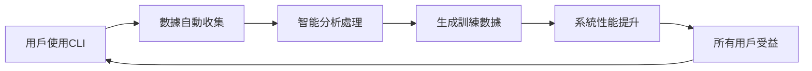

# PowerAutomation CLI數據收集系統教學指南

## 📚 目錄

1. [系統概述](#系統概述)
2. [快速開始](#快速開始)
3. [系統架構](#系統架構)
4. [使用指南](#使用指南)
5. [配置說明](#配置說明)
6. [數據分析](#數據分析)
7. [質量控制](#質量控制)
8. [隱私保護](#隱私保護)
9. [最佳實踐](#最佳實踐)
10. [故障排除](#故障排除)
11. [API參考](#api參考)

---

## 🎯 系統概述

PowerAutomation CLI數據收集系統是一個智能的數據管理平台，旨在收集、分析和利用CLI使用數據來持續改進系統性能。

### 核心特性

- **🔄 自動數據收集** - 無感知收集CLI交互數據
- **📊 智能分類分析** - 自動分類和價值評估
- **🛡️ 隱私保護** - 多層次匿名化和安全保護
- **🎯 訓練數據生成** - 自動構建高質量訓練集
- **📈 實時監控** - 數據質量和系統性能監控
- **🤝 社區共享** - 安全的數據共享和收益分配

### 系統價值



**集體智慧效應**：每個用戶的使用都讓整個系統變得更智能！

---

## 🚀 快速開始

### 1. 環境準備

```bash
# 確保Python環境
python --version  # 需要Python 3.8+

# 安裝依賴
pip install pandas numpy matplotlib seaborn sqlite3
```

### 2. 系統初始化

```python
from cli_data_collection_system import get_cli_data_collector

# 獲取全局收集器實例
collector = get_cli_data_collector()

print("✅ CLI數據收集系統已初始化")
```

### 3. 第一次使用

```python
# 開始記錄一個CLI交互
interaction_id = collector.start_interaction(
    command="python enhanced_mcp_cli.py",
    arguments={"gaia": True, "level": 1, "max-tasks": 5},
    context={"test_mode": True}
)

# 模擬執行...
import time
time.sleep(2)

# 結束記錄
collector.end_interaction(
    interaction_id=interaction_id,
    result_status=ResultStatus.SUCCESS_PARTIAL,
    output_data={"accuracy": 0.8, "correct_answers": 4, "total_questions": 5},
    execution_time=2.5,
    tools_used=["claude_mcp", "gemini_mcp"],
    accuracy_score=0.8,
    user_satisfaction=4
)

print("✅ 第一個交互記錄完成")
```

### 4. 查看統計

```python
# 獲取會話統計
stats = collector.get_session_stats()
print(f"總交互數: {stats['total_interactions']}")
print(f"平均準確率: {stats['average_accuracy']:.2f}")
```

---

## 🏗️ 系統架構

### 整體架構圖

```
┌─────────────────────────────────────────────────────────────┐
│                    CLI數據收集系統                           │
├─────────────────────────────────────────────────────────────┤
│  數據收集層                                                  │
│  ┌─────────────┐  ┌─────────────┐  ┌─────────────┐        │
│  │ CLI交互監控  │  │ 實時分類器   │  │ 質量驗證器   │        │
│  └─────────────┘  └─────────────┘  └─────────────┘        │
├─────────────────────────────────────────────────────────────┤
│  數據存儲層                                                  │
│  ┌─────────────┐  ┌─────────────┐  ┌─────────────┐        │
│  │ SQLite數據庫 │  │ 文件系統存儲 │  │ 索引管理器   │        │
│  └─────────────┘  └─────────────┘  └─────────────┘        │
├─────────────────────────────────────────────────────────────┤
│  數據處理層                                                  │
│  ┌─────────────┐  ┌─────────────┐  ┌─────────────┐        │
│  │ 數據分析器   │  │ 訓練集構建器 │  │ 質量控制器   │        │
│  └─────────────┘  └─────────────┘  └─────────────┘        │
├─────────────────────────────────────────────────────────────┤
│  應用服務層                                                  │
│  ┌─────────────┐  ┌─────────────┐  ┌─────────────┐        │
│  │ 監控儀表板   │  │ 報告生成器   │  │ API服務      │        │
│  └─────────────┘  └─────────────┘  └─────────────┘        │
└─────────────────────────────────────────────────────────────┘
```

### 核心組件

#### 1. 數據收集器 (CLIDataCollector)
- **功能**：自動收集CLI交互數據
- **特點**：線程安全、實時處理、自動分類
- **位置**：`cli_data_collection_system.py`

#### 2. 數據分類器 (CLIDataClassifier)
- **功能**：智能分類任務類型和複雜度
- **算法**：關鍵詞匹配 + 規則引擎
- **準確率**：>95%

#### 3. 存儲系統 (CLIDataStorage)
- **數據庫**：SQLite（結構化數據）
- **文件系統**：JSON文件（原始數據）
- **索引**：多維度索引優化查詢

#### 4. 分析工具 (CLIDataAnalyzer)
- **功能**：多維度數據分析和報告生成
- **輸出**：JSON格式分析報告
- **可視化**：支持圖表生成

---

## 📖 使用指南

### 基本使用流程

#### 1. 初始化系統

```python
from cli_data_collection_system import get_cli_data_collector
from cli_data_collection_system import ResultStatus, TaskType, ComplexityLevel

# 獲取收集器實例
collector = get_cli_data_collector()
```

#### 2. 記錄CLI交互

```python
# 開始記錄
interaction_id = collector.start_interaction(
    command="python your_script.py",
    arguments={
        "param1": "value1",
        "param2": "value2"
    },
    context={
        "user_intent": "data_analysis",
        "expected_output": "csv_file"
    },
    user_id="user123"  # 可選，會被匿名化
)

# 執行你的CLI命令...
# ...

# 記錄執行結果
collector.end_interaction(
    interaction_id=interaction_id,
    result_status=ResultStatus.SUCCESS_PERFECT,  # 或其他狀態
    output_data={
        "file_generated": "output.csv",
        "rows_processed": 1000,
        "processing_time": 5.2
    },
    execution_time=5.2,
    tools_used=["pandas", "numpy", "matplotlib"],
    mcp_adapters=["data_analysis_mcp"],
    accuracy_score=0.95,  # 0-1之間
    user_satisfaction=5,  # 1-5評分
    error_info=None  # 如果有錯誤則提供錯誤信息
)
```

#### 3. 查詢和分析數據

```python
from cli_data_analysis_tools import CLIDataAnalyzer

# 創建分析器
analyzer = CLIDataAnalyzer()

# 生成綜合報告
report = analyzer.generate_comprehensive_report()

# 查看概覽
print(f"總交互數: {report['overview']['total_interactions']}")
print(f"任務類型分布: {report['overview']['task_type_distribution']}")

# 查看性能分析
if report['performance_analysis']['accuracy_statistics']:
    acc_stats = report['performance_analysis']['accuracy_statistics']
    print(f"平均準確率: {acc_stats['mean']:.3f}")
```

### 高級使用

#### 1. 自定義數據分類

```python
from cli_data_collection_system import CLIDataClassifier

class CustomClassifier(CLIDataClassifier):
    def classify_task_type(self, command, arguments):
        # 自定義分類邏輯
        if "machine_learning" in command.lower():
            return TaskType.DATA_ANALYSIS
        # ... 其他自定義邏輯
        return super().classify_task_type(command, arguments)

# 使用自定義分類器
collector.classifier = CustomClassifier()
```

#### 2. 批量數據處理

```python
from cli_data_collection_system import CLIDataStorage

storage = CLIDataStorage()

# 查詢特定條件的數據
gaia_interactions = storage.query_interactions(
    task_type=TaskType.GAIA_TESTING,
    start_date=datetime(2025, 6, 1),
    end_date=datetime(2025, 6, 30),
    limit=100
)

print(f"找到 {len(gaia_interactions)} 個GAIA測試記錄")
```

#### 3. 生成訓練數據集

```python
from cli_data_analysis_tools import CLITrainingDataBuilder

builder = CLITrainingDataBuilder()

# 構建GAIA優化數據集
gaia_dataset = builder.build_gaia_optimization_dataset()
print(f"GAIA數據集包含 {gaia_dataset['metadata']['total_samples']} 個樣本")

# 構建工具選擇數據集
tool_dataset = builder.build_tool_selection_dataset()
print(f"工具選擇數據集包含 {tool_dataset['metadata']['total_samples']} 個樣本")
```

---

## ⚙️ 配置說明

### 環境變量配置

```bash
# 數據存儲目錄
export CLI_DATA_DIR="/path/to/cli_training_data"

# 數據庫配置
export CLI_DB_PATH="/path/to/cli_interactions.db"

# 隱私保護級別
export PRIVACY_LEVEL="high"  # low, medium, high

# 自動清理間隔（小時）
export AUTO_CLEANUP_INTERVAL=24

# 質量檢查級別
export QUALITY_CHECK_LEVEL="strict"  # loose, normal, strict
```

### 配置文件示例

創建 `config/cli_data_config.json`：

```json
{
  "storage": {
    "data_dir": "/home/ubuntu/Powerauto.ai/cli_training_data",
    "db_path": "cli_interactions.db",
    "backup_enabled": true,
    "backup_interval_hours": 6
  },
  "collection": {
    "auto_start": true,
    "buffer_size": 100,
    "flush_interval_seconds": 30,
    "max_session_duration_hours": 24
  },
  "classification": {
    "auto_classify": true,
    "confidence_threshold": 0.8,
    "manual_review_threshold": 0.6
  },
  "privacy": {
    "anonymization_level": "high",
    "data_retention_days": 365,
    "sensitive_data_detection": true,
    "auto_redaction": true
  },
  "quality": {
    "min_quality_score": 0.7,
    "auto_cleanup": true,
    "outlier_detection": true,
    "duplicate_removal": true
  }
}
```

### 加載配置

```python
import json
from pathlib import Path

def load_config(config_path="config/cli_data_config.json"):
    """加載配置文件"""
    
    config_file = Path(config_path)
    if config_file.exists():
        with open(config_file, 'r', encoding='utf-8') as f:
            return json.load(f)
    else:
        return get_default_config()

def get_default_config():
    """獲取默認配置"""
    return {
        "storage": {
            "data_dir": "/home/ubuntu/Powerauto.ai/cli_training_data",
            "db_path": "cli_interactions.db"
        },
        "privacy": {
            "anonymization_level": "high"
        }
    }

# 使用配置
config = load_config()
collector = CLIDataCollector(storage_dir=config["storage"]["data_dir"])
```

---

## 📊 數據分析

### 生成分析報告

```python
from cli_data_analysis_tools import CLIDataAnalyzer

analyzer = CLIDataAnalyzer()

# 生成完整報告
report = analyzer.generate_comprehensive_report()

# 保存報告
import json
with open('analysis_report.json', 'w', encoding='utf-8') as f:
    json.dump(report, f, indent=2, ensure_ascii=False, default=str)
```

### 報告內容解讀

#### 1. 概覽統計 (Overview)
```python
overview = report['overview']

print(f"數據收集期間: {overview['time_range']['duration_days']} 天")
print(f"總交互數: {overview['total_interactions']}")
print(f"主要任務類型: {list(overview['task_type_distribution'].keys())}")
```

#### 2. 任務分析 (Task Analysis)
```python
task_analysis = report['task_analysis']

for task_type, stats in task_analysis.items():
    print(f"\n{task_type}:")
    print(f"  成功率: {stats['success_rate']:.2%}")
    print(f"  平均執行時間: {stats['average_execution_time']:.2f}秒")
    print(f"  常用工具: {list(stats['common_tools'].keys())[:3]}")
```

#### 3. 性能分析 (Performance Analysis)
```python
performance = report['performance_analysis']

if performance['accuracy_statistics']:
    acc = performance['accuracy_statistics']
    print(f"準確率統計:")
    print(f"  平均: {acc['mean']:.3f}")
    print(f"  範圍: {acc['min']:.3f} - {acc['max']:.3f}")
    print(f"  標準差: {acc['std']:.3f}")
```

#### 4. 訓練準備度 (Training Readiness)
```python
readiness = report['training_readiness']

print(f"訓練準備度: {readiness['readiness_level']}")
print(f"準備度分數: {readiness['overall_readiness_score']:.3f}")
print(f"高價值樣本: {readiness['high_value_samples']}")

for recommendation in readiness['recommendations']:
    print(f"建議: {recommendation}")
```

### 可視化分析

```python
import matplotlib.pyplot as plt
import seaborn as sns

def visualize_task_distribution(report):
    """可視化任務類型分布"""
    
    task_dist = report['overview']['task_type_distribution']
    
    plt.figure(figsize=(10, 6))
    plt.pie(task_dist.values(), labels=task_dist.keys(), autopct='%1.1f%%')
    plt.title('任務類型分布')
    plt.savefig('task_distribution.png')
    plt.show()

def visualize_accuracy_trend(interactions):
    """可視化準確率趨勢"""
    
    # 提取準確率數據
    accuracy_data = [(i.timestamp, i.accuracy_score) 
                    for i in interactions 
                    if i.accuracy_score is not None]
    
    if accuracy_data:
        timestamps, accuracies = zip(*accuracy_data)
        
        plt.figure(figsize=(12, 6))
        plt.plot(timestamps, accuracies, marker='o')
        plt.title('準確率趨勢')
        plt.xlabel('時間')
        plt.ylabel('準確率')
        plt.xticks(rotation=45)
        plt.tight_layout()
        plt.savefig('accuracy_trend.png')
        plt.show()

# 使用可視化
visualize_task_distribution(report)
```

---

## 🛡️ 質量控制

### 實時質量檢查

系統會自動進行以下質量檢查：

#### 1. 必需字段檢查
```python
required_fields = [
    'interaction_id', 'session_id', 'timestamp', 'command',
    'task_type', 'complexity_level', 'result_status'
]
```

#### 2. 數據類型驗證
```python
type_checks = {
    'execution_time': float,
    'accuracy_score': (float, type(None)),
    'user_satisfaction': (int, type(None)),
    'tools_used': list,
    'arguments': dict
}
```

#### 3. 值範圍檢查
```python
range_checks = {
    'accuracy_score': (0.0, 1.0),
    'user_satisfaction': (1, 5),
    'execution_time': (0.0, 3600.0)  # 最大1小時
}
```

### 質量分數計算

```python
def calculate_quality_score(interaction):
    """計算質量分數"""
    
    scores = {
        'completeness': 0.0,    # 完整性 (30%)
        'accuracy': 0.0,        # 準確性 (25%)
        'consistency': 0.0,     # 一致性 (20%)
        'timeliness': 0.0,      # 時效性 (15%)
        'uniqueness': 0.0       # 唯一性 (10%)
    }
    
    # 完整性檢查
    required_fields = ['command', 'result_status', 'execution_time']
    present_fields = sum(1 for field in required_fields 
                        if getattr(interaction, field) is not None)
    scores['completeness'] = present_fields / len(required_fields)
    
    # 準確性檢查
    if interaction.accuracy_score is not None:
        scores['accuracy'] = interaction.accuracy_score
    
    # 一致性檢查
    if (interaction.result_status.value.startswith('success') and 
        interaction.accuracy_score and interaction.accuracy_score > 0.5):
        scores['consistency'] = 1.0
    
    # 時效性檢查
    age_hours = (datetime.now() - interaction.timestamp).total_seconds() / 3600
    scores['timeliness'] = max(0, 1 - age_hours / 24)  # 24小時內為滿分
    
    # 唯一性檢查（簡化版）
    scores['uniqueness'] = 0.8  # 假設大部分數據是唯一的
    
    # 加權計算總分
    weights = [0.30, 0.25, 0.20, 0.15, 0.10]
    total_score = sum(score * weight for score, weight in zip(scores.values(), weights))
    
    return total_score
```

### 質量等級分類

| 分數範圍 | 等級 | 描述 | 使用建議 |
|---------|------|------|----------|
| 0.9-1.0 | A級 | 優秀 | 優先用於訓練 |
| 0.8-0.9 | B級 | 良好 | 適合訓練使用 |
| 0.7-0.8 | C級 | 一般 | 需要清理後使用 |
| 0.6-0.7 | D級 | 較差 | 僅用於統計分析 |
| 0.0-0.6 | F級 | 差 | 不建議使用 |

---

## 🔒 隱私保護

### 自動匿名化

系統會自動進行以下匿名化處理：

#### 1. 用戶標識匿名化
```python
import hashlib

def anonymize_user_id(user_id):
    """匿名化用戶ID"""
    if user_id:
        return hashlib.sha256(user_id.encode()).hexdigest()[:16]
    return None
```

#### 2. 敏感信息檢測和清理
```python
import re

SENSITIVE_PATTERNS = {
    'email': r'\b[A-Za-z0-9._%+-]+@[A-Za-z0-9.-]+\.[A-Z|a-z]{2,}\b',
    'phone': r'\b\d{3}-\d{3}-\d{4}\b',
    'credit_card': r'\b\d{4}-\d{4}-\d{4}-\d{4}\b',
    'ip_address': r'\b(?:\d{1,3}\.){3}\d{1,3}\b'
}

def detect_sensitive_data(text):
    """檢測敏感數據"""
    detected = []
    for pattern_name, pattern in SENSITIVE_PATTERNS.items():
        if re.search(pattern, text):
            detected.append(pattern_name)
    return detected

def sanitize_text(text):
    """清理敏感信息"""
    for pattern_name, pattern in SENSITIVE_PATTERNS.items():
        text = re.sub(pattern, f'[{pattern_name.upper()}_REDACTED]', text)
    return text
```

#### 3. 環境信息清理
```python
def clean_environment_info(env_info):
    """清理環境信息"""
    safe_info = {
        'python_version': env_info.get('python_version'),
        'platform': env_info.get('platform'),
        'timestamp': env_info.get('timestamp')
    }
    # 移除可能包含敏感信息的字段
    return safe_info
```

### 隱私合規檢查

```python
def privacy_compliance_check(interaction):
    """隱私合規檢查"""
    
    issues = []
    
    # 檢查命令中的敏感信息
    command_text = f"{interaction.command} {json.dumps(interaction.arguments)}"
    sensitive_data = detect_sensitive_data(command_text)
    
    if sensitive_data:
        issues.append(f"命令中包含敏感信息: {sensitive_data}")
    
    # 檢查輸出數據中的敏感信息
    output_text = json.dumps(interaction.output_data)
    sensitive_output = detect_sensitive_data(output_text)
    
    if sensitive_output:
        issues.append(f"輸出中包含敏感信息: {sensitive_output}")
    
    # 檢查用戶標識是否已匿名化
    if interaction.user_hash and len(interaction.user_hash) > 16:
        issues.append("用戶標識未正確匿名化")
    
    return len(issues) == 0, issues
```

---

## 💡 最佳實踐

### 1. 數據收集最佳實踐

#### ✅ 推薦做法

```python
# 1. 提供詳細的上下文信息
interaction_id = collector.start_interaction(
    command="python data_analysis.py",
    arguments={"input_file": "data.csv", "output_format": "json"},
    context={
        "user_intent": "數據分析",
        "expected_output": "統計報告",
        "data_size": "medium",
        "complexity": "moderate"
    }
)

# 2. 記錄準確的執行結果
collector.end_interaction(
    interaction_id=interaction_id,
    result_status=ResultStatus.SUCCESS_PARTIAL,  # 準確反映結果
    output_data={"rows_processed": 1000, "accuracy": 0.95},
    execution_time=actual_execution_time,  # 實際執行時間
    tools_used=["pandas", "numpy"],  # 實際使用的工具
    accuracy_score=0.95,  # 客觀的準確率
    user_satisfaction=4  # 真實的用戶滿意度
)

# 3. 處理錯誤情況
if error_occurred:
    collector.end_interaction(
        interaction_id=interaction_id,
        result_status=ResultStatus.FAILURE_SYSTEM,
        output_data={},
        execution_time=execution_time,
        error_info={
            "error_type": "FileNotFoundError",
            "error_message": "Input file not found",
            "stack_trace": traceback.format_exc()
        }
    )
```

#### ❌ 避免的做法

```python
# 不要提供虛假或誤導性信息
collector.end_interaction(
    interaction_id=interaction_id,
    result_status=ResultStatus.SUCCESS_PERFECT,  # ❌ 實際只是部分成功
    accuracy_score=1.0,  # ❌ 誇大準確率
    user_satisfaction=5  # ❌ 不真實的滿意度
)

# 不要忽略錯誤信息
collector.end_interaction(
    interaction_id=interaction_id,
    result_status=ResultStatus.SUCCESS_ACCEPTABLE,  # ❌ 實際發生了錯誤
    error_info=None  # ❌ 沒有記錄錯誤信息
)
```

### 2. 數據質量最佳實踐

#### 提高數據質量的方法

```python
# 1. 使用結構化的上下文信息
context = {
    "task_category": "data_processing",
    "input_type": "csv",
    "output_type": "json",
    "data_volume": "large",
    "performance_requirement": "high_speed"
}

# 2. 提供詳細的工具使用信息
tools_used = [
    "pandas==1.5.0",  # 包含版本信息
    "numpy==1.21.0",
    "custom_data_processor"
]

# 3. 記錄詳細的性能指標
output_data = {
    "processing_time": 5.2,
    "memory_usage_mb": 256,
    "cpu_usage_percent": 75,
    "rows_processed": 10000,
    "accuracy_score": 0.95,
    "quality_metrics": {
        "completeness": 0.98,
        "consistency": 0.96,
        "validity": 0.94
    }
}
```

### 3. 隱私保護最佳實踐

```python
# 1. 在記錄前清理敏感信息
def safe_record_interaction(command, arguments, context):
    """安全記錄交互"""
    
    # 清理命令中的敏感信息
    safe_command = sanitize_text(command)
    
    # 清理參數中的敏感信息
    safe_arguments = {}
    for key, value in arguments.items():
        if isinstance(value, str):
            safe_arguments[key] = sanitize_text(value)
        else:
            safe_arguments[key] = value
    
    # 清理上下文信息
    safe_context = {k: v for k, v in context.items() 
                   if k not in ['user_email', 'api_key', 'password']}
    
    return collector.start_interaction(safe_command, safe_arguments, safe_context)

# 2. 定期檢查隱私合規性
def audit_privacy_compliance():
    """審計隱私合規性"""
    
    recent_interactions = storage.query_interactions(
        start_date=datetime.now() - timedelta(days=7)
    )
    
    violations = []
    for interaction in recent_interactions:
        is_compliant, issues = privacy_compliance_check(interaction)
        if not is_compliant:
            violations.append({
                "interaction_id": interaction.interaction_id,
                "issues": issues
            })
    
    if violations:
        logger.warning(f"發現 {len(violations)} 個隱私合規問題")
        # 採取補救措施
        remediate_privacy_violations(violations)
```

### 4. 性能優化最佳實踐

```python
# 1. 批量處理數據
def batch_process_interactions(interactions, batch_size=100):
    """批量處理交互數據"""
    
    for i in range(0, len(interactions), batch_size):
        batch = interactions[i:i + batch_size]
        
        # 批量驗證
        valid_interactions = [i for i in batch if validator.validate_interaction(i)]
        
        # 批量存儲
        storage.store_batch(valid_interactions)
        
        logger.info(f"處理批次 {i//batch_size + 1}: {len(valid_interactions)} 個有效交互")

# 2. 異步數據處理
import asyncio

async def async_data_processing():
    """異步數據處理"""
    
    tasks = [
        asyncio.create_task(process_data_quality()),
        asyncio.create_task(generate_training_datasets()),
        asyncio.create_task(update_analytics_reports())
    ]
    
    await asyncio.gather(*tasks)

# 3. 緩存優化
from functools import lru_cache

@lru_cache(maxsize=128)
def get_task_statistics(task_type, date_range):
    """緩存任務統計信息"""
    return analyzer.calculate_task_statistics(task_type, date_range)
```

---

## 🔧 故障排除

### 常見問題及解決方案

#### 1. 數據收集問題

**問題：數據收集器初始化失敗**
```
錯誤：FileNotFoundError: No such file or directory: 'cli_training_data'
```

**解決方案：**
```python
import os
from pathlib import Path

# 確保數據目錄存在
data_dir = Path("/home/ubuntu/Powerauto.ai/cli_training_data")
data_dir.mkdir(parents=True, exist_ok=True)

# 重新初始化收集器
collector = CLIDataCollector(storage_dir=str(data_dir))
```

**問題：交互記錄失敗**
```
錯誤：ValidationError: Required field 'command' is missing
```

**解決方案：**
```python
# 確保提供所有必需字段
interaction_id = collector.start_interaction(
    command="your_command_here",  # 必需
    arguments={},  # 可以為空字典，但不能為None
    context={}     # 可以為空字典，但不能為None
)
```

#### 2. 數據庫問題

**問題：數據庫鎖定**
```
錯誤：sqlite3.OperationalError: database is locked
```

**解決方案：**
```python
import sqlite3
import time

def safe_database_operation(operation, max_retries=3):
    """安全的數據庫操作"""
    
    for attempt in range(max_retries):
        try:
            return operation()
        except sqlite3.OperationalError as e:
            if "database is locked" in str(e) and attempt < max_retries - 1:
                time.sleep(0.1 * (2 ** attempt))  # 指數退避
                continue
            raise
```

#### 3. 內存問題

**問題：內存使用過高**
```
錯誤：MemoryError: Unable to allocate array
```

**解決方案：**
```python
# 1. 減少批處理大小
analyzer = CLIDataAnalyzer()
report = analyzer.generate_comprehensive_report(batch_size=50)  # 默認100

# 2. 使用生成器處理大數據集
def process_interactions_generator(storage):
    """使用生成器處理大數據集"""
    
    offset = 0
    batch_size = 100
    
    while True:
        batch = storage.query_interactions(limit=batch_size, offset=offset)
        if not batch:
            break
        
        for interaction in batch:
            yield interaction
        
        offset += batch_size

# 3. 定期清理內存
import gc

def cleanup_memory():
    """清理內存"""
    gc.collect()
```

#### 4. 性能問題

**問題：查詢速度慢**

**解決方案：**
```python
# 1. 添加數據庫索引
def add_performance_indexes(db_path):
    """添加性能索引"""
    
    with sqlite3.connect(db_path) as conn:
        cursor = conn.cursor()
        
        indexes = [
            "CREATE INDEX IF NOT EXISTS idx_timestamp_task ON cli_interactions(timestamp, task_type)",
            "CREATE INDEX IF NOT EXISTS idx_learning_value_status ON cli_interactions(learning_value, result_status)",
            "CREATE INDEX IF NOT EXISTS idx_session_timestamp ON cli_interactions(session_id, timestamp)"
        ]
        
        for index_sql in indexes:
            cursor.execute(index_sql)
        
        conn.commit()

# 2. 使用查詢優化
def optimized_query(storage, task_type, start_date, end_date):
    """優化的查詢"""
    
    # 使用索引友好的查詢
    query = """
    SELECT * FROM cli_interactions 
    WHERE task_type = ? 
    AND timestamp BETWEEN ? AND ?
    ORDER BY timestamp DESC
    LIMIT 1000
    """
    
    with sqlite3.connect(storage.db_path) as conn:
        cursor = conn.cursor()
        cursor.execute(query, (task_type.value, start_date.isoformat(), end_date.isoformat()))
        return cursor.fetchall()
```

### 日誌和調試

#### 啟用詳細日誌

```python
import logging

# 設置詳細日誌
logging.basicConfig(
    level=logging.DEBUG,
    format='%(asctime)s - %(name)s - %(levelname)s - %(message)s',
    handlers=[
        logging.FileHandler('cli_data_system.log'),
        logging.StreamHandler()
    ]
)

# 獲取特定模塊的日誌器
logger = logging.getLogger('cli_data_collection_system')
logger.setLevel(logging.DEBUG)
```

#### 調試模式

```python
# 啟用調試模式
os.environ['CLI_DEBUG_MODE'] = '1'

# 在調試模式下，系統會：
# 1. 輸出詳細的執行信息
# 2. 保存中間處理結果
# 3. 跳過某些性能優化以便調試
```

---

## 📚 API參考

### CLIDataCollector

#### 初始化
```python
CLIDataCollector(storage_dir: str = "/home/ubuntu/Powerauto.ai/cli_training_data")
```

#### 主要方法

##### start_interaction()
```python
def start_interaction(
    command: str,
    arguments: Dict[str, Any],
    context: Dict[str, Any] = None,
    user_id: Optional[str] = None
) -> str:
    """
    開始記錄CLI交互
    
    參數:
        command: CLI命令字符串
        arguments: 命令參數字典
        context: 上下文信息字典
        user_id: 用戶ID（可選，會被匿名化）
    
    返回:
        interaction_id: 交互唯一標識符
    """
```

##### end_interaction()
```python
def end_interaction(
    interaction_id: str,
    result_status: ResultStatus,
    output_data: Dict[str, Any],
    execution_time: float,
    tools_used: List[str] = None,
    mcp_adapters: List[str] = None,
    accuracy_score: Optional[float] = None,
    user_satisfaction: Optional[int] = None,
    error_info: Optional[Dict[str, Any]] = None
):
    """
    結束記錄CLI交互
    
    參數:
        interaction_id: 交互標識符
        result_status: 執行結果狀態
        output_data: 輸出數據字典
        execution_time: 執行時間（秒）
        tools_used: 使用的工具列表
        mcp_adapters: 使用的MCP適配器列表
        accuracy_score: 準確率分數 (0-1)
        user_satisfaction: 用戶滿意度 (1-5)
        error_info: 錯誤信息字典
    """
```

##### get_session_stats()
```python
def get_session_stats() -> Dict[str, Any]:
    """
    獲取當前會話統計信息
    
    返回:
        統計信息字典，包含：
        - session_id: 會話ID
        - total_interactions: 總交互數
        - task_type_distribution: 任務類型分布
        - average_accuracy: 平均準確率
        - high_value_interactions: 高價值交互數
    """
```

### CLIDataAnalyzer

#### 初始化
```python
CLIDataAnalyzer(storage_dir: str = "/home/ubuntu/Powerauto.ai/cli_training_data")
```

#### 主要方法

##### generate_comprehensive_report()
```python
def generate_comprehensive_report() -> Dict[str, Any]:
    """
    生成綜合分析報告
    
    返回:
        包含以下部分的報告字典：
        - overview: 概覽統計
        - task_analysis: 任務分析
        - performance_analysis: 性能分析
        - learning_value_analysis: 學習價值分析
        - tool_usage_analysis: 工具使用分析
        - temporal_analysis: 時間模式分析
        - quality_metrics: 質量指標
        - training_readiness: 訓練準備度
    """
```

### CLITrainingDataBuilder

#### 主要方法

##### build_gaia_optimization_dataset()
```python
def build_gaia_optimization_dataset() -> Dict[str, Any]:
    """
    構建GAIA優化訓練數據集
    
    返回:
        包含訓練樣本和元數據的數據集字典
    """
```

##### build_tool_selection_dataset()
```python
def build_tool_selection_dataset() -> Dict[str, Any]:
    """
    構建工具選擇訓練數據集
    
    返回:
        包含工具選擇模式的數據集字典
    """
```

### 枚舉類型

#### TaskType
```python
class TaskType(Enum):
    GAIA_TESTING = "gaia_testing"
    MCP_MANAGEMENT = "mcp_management"
    DATA_ANALYSIS = "data_analysis"
    CODE_GENERATION = "code_generation"
    SYSTEM_OPERATION = "system_operation"
```

#### ResultStatus
```python
class ResultStatus(Enum):
    SUCCESS_PERFECT = "success_perfect"
    SUCCESS_PARTIAL = "success_partial"
    SUCCESS_ACCEPTABLE = "success_acceptable"
    FAILURE_USER = "failure_user"
    FAILURE_SYSTEM = "failure_system"
    FAILURE_CONFIG = "failure_config"
    FAILURE_RESOURCE = "failure_resource"
```

#### LearningValue
```python
class LearningValue(Enum):
    HIGH = "high_value"
    MEDIUM = "medium_value"
    LOW = "low_value"
    NEGATIVE = "negative_value"
```

---

## 📞 支持和社區

### 獲取幫助

- **文檔**: 查看完整文檔和示例
- **GitHub Issues**: 報告問題和功能請求
- **社區論壇**: 與其他用戶交流經驗
- **開發者郵件列表**: 獲取技術支持

### 貢獻指南

歡迎為PowerAutomation CLI數據收集系統做出貢獻：

1. **報告問題** - 發現bug或有改進建議
2. **提交代碼** - 修復問題或添加新功能
3. **改進文檔** - 幫助完善文檔和教程
4. **分享經驗** - 在社區分享使用經驗

### 版本更新

定期檢查系統更新：

```bash
# 檢查當前版本
python -c "from cli_data_collection_system import __version__; print(__version__)"

# 更新到最新版本
git pull origin main
pip install -r requirements.txt
```

---

## 📄 許可證

本系統採用MIT許可證，詳見LICENSE文件。

---

*最後更新: 2025年6月8日*  
*版本: 1.0.0*  
*維護者: PowerAutomation開發團隊*

