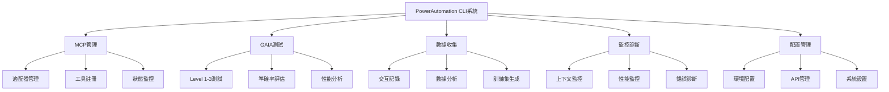

# PowerAutomation CLI系統完整教學指南

## 📚 目錄

1. [系統概述](#系統概述)
2. [CLI工具總覽](#cli工具總覽)
3. [主要CLI工具詳解](#主要cli工具詳解)
4. [MCP管理CLI](#mcp管理cli)
5. [GAIA測試CLI](#gaia測試cli)
6. [數據收集CLI](#數據收集cli)
7. [監控和診斷CLI](#監控和診斷cli)
8. [配置和管理CLI](#配置和管理cli)
9. [高級使用技巧](#高級使用技巧)
10. [故障排除](#故障排除)
11. [最佳實踐](#最佳實踐)

---

## 🎯 系統概述

PowerAutomation提供了一套完整的命令行工具（CLI），涵蓋系統的各個方面：

### 核心功能模塊



### 設計理念

- **🔧 模塊化設計** - 每個CLI工具專注特定功能
- **🔄 統一接口** - 一致的命令行參數和輸出格式
- **📊 數據驅動** - 所有操作都可記錄和分析
- **🛡️ 安全優先** - 內建隱私保護和安全機制
- **🚀 高性能** - 優化的執行效率和資源使用

---

## 🛠️ CLI工具總覽

### 主要CLI工具列表

| CLI工具 | 文件名 | 主要功能 | 使用場景 |
|---------|--------|----------|----------|
| **主CLI** | `powerautomation_cli.py` | 統一入口，路由所有命令 | 日常使用的主要接口 |
| **MCP管理** | `enhanced_mcp_cli.py` | MCP適配器管理和測試 | 管理和測試MCP組件 |
| **GAIA測試** | `real_api_gaia_tester.py` | GAIA基準測試 | 評估系統AI能力 |
| **數據收集** | `cli_data_collection_system.py` | 自動數據收集和分析 | 收集使用數據改進系統 |
| **上下文監控** | `context_monitor_cli.py` | 監控上下文使用情況 | 防止上下文溢出 |
| **配置管理** | `mcptool/cli/config_cli.py` | 系統配置管理 | 管理系統設置和API密鑰 |

### 輔助CLI工具

| CLI工具 | 功能描述 |
|---------|----------|
| `unified_mcp_cli.py` | 統一MCP適配器接口 |
| `rollback_cli.py` | 系統回滾和恢復 |
| `unified_cli_tester.py` | CLI功能測試 |
| `mcpcoordinator_cli.py` | MCP協調器管理 |

---

## 🚀 主要CLI工具詳解

### 1. PowerAutomation主CLI

#### 基本使用

```bash
# 查看幫助
python powerautomation_cli.py --help

# 交互式模式
python powerautomation_cli.py --interactive

# 執行特定命令
python powerautomation_cli.py --command "mcp list"

# 批處理模式
python powerautomation_cli.py --batch commands.txt
```

#### 主要功能

##### A. 命令路由
```bash
# MCP相關命令
python powerautomation_cli.py --command "mcp status"
python powerautomation_cli.py --command "mcp test claude"

# GAIA測試命令
python powerautomation_cli.py --command "gaia test --level 1 --count 5"

# 數據分析命令
python powerautomation_cli.py --command "data analyze --period week"
```

##### B. 交互式模式
```bash
python powerautomation_cli.py --interactive
```

進入交互式模式後：
```
PowerAutomation> help
PowerAutomation> mcp list
PowerAutomation> gaia test --level 1
PowerAutomation> data stats
PowerAutomation> exit
```

##### C. 批處理模式
創建命令文件 `commands.txt`：
```
mcp status
gaia test --level 1 --count 3
data analyze --period day
mcp test gemini
```

執行批處理：
```bash
python powerautomation_cli.py --batch commands.txt
```

#### 配置選項

```bash
# 設置日誌級別
python powerautomation_cli.py --log-level DEBUG --command "mcp status"

# 指定配置文件
python powerautomation_cli.py --config custom_config.json --interactive

# 輸出格式
python powerautomation_cli.py --output json --command "mcp list"
python powerautomation_cli.py --output table --command "gaia stats"
```

---

## 🔧 MCP管理CLI

### 增強版MCP CLI (`enhanced_mcp_cli.py`)

#### 基本命令

```bash
# 查看所有可用適配器
python mcptool/cli/enhanced_mcp_cli.py --list

# 檢查系統狀態
python mcptool/cli/enhanced_mcp_cli.py --status

# 測試特定適配器
python mcptool/cli/enhanced_mcp_cli.py --test claude

# 運行GAIA測試
python mcptool/cli/enhanced_mcp_cli.py --gaia --level 1 --max-tasks 5
```

#### 適配器管理

##### A. 查看適配器信息
```bash
# 列出所有適配器
python enhanced_mcp_cli.py --list

# 查看特定適配器詳情
python enhanced_mcp_cli.py --info claude_mcp

# 檢查適配器狀態
python enhanced_mcp_cli.py --status claude_mcp
```

##### B. 測試適配器
```bash
# 測試單個適配器
python enhanced_mcp_cli.py --test claude_mcp

# 測試所有適配器
python enhanced_mcp_cli.py --test-all

# 深度測試
python enhanced_mcp_cli.py --test claude_mcp --deep
```

##### C. 適配器配置
```bash
# 配置API密鑰
python enhanced_mcp_cli.py --configure claude_mcp --api-key YOUR_KEY

# 設置適配器參數
python enhanced_mcp_cli.py --configure gemini_mcp --model gemini-2.0-flash

# 查看配置
python enhanced_mcp_cli.py --show-config claude_mcp
```

#### GAIA測試集成

```bash
# 運行Level 1測試
python enhanced_mcp_cli.py --gaia --level 1 --max-tasks 10

# 運行所有級別測試
python enhanced_mcp_cli.py --gaia --level all --max-tasks 5

# 指定特定適配器進行測試
python enhanced_mcp_cli.py --gaia --level 1 --adapter claude_mcp

# 生成詳細報告
python enhanced_mcp_cli.py --gaia --level 1 --report detailed
```

#### 高級功能

##### A. 性能監控
```bash
# 監控適配器性能
python enhanced_mcp_cli.py --monitor claude_mcp --duration 60

# 性能基準測試
python enhanced_mcp_cli.py --benchmark --adapter claude_mcp --iterations 10

# 生成性能報告
python enhanced_mcp_cli.py --performance-report --period week
```

##### B. 調試和診斷
```bash
# 啟用調試模式
python enhanced_mcp_cli.py --debug --test claude_mcp

# 診斷適配器問題
python enhanced_mcp_cli.py --diagnose claude_mcp

# 查看詳細日誌
python enhanced_mcp_cli.py --logs claude_mcp --tail 100
```

---

## 🧪 GAIA測試CLI

### 真實API GAIA測試器 (`real_api_gaia_tester.py`)

#### 基本測試

```bash
# Level 1測試（5個問題）
python real_api_gaia_tester.py --level 1 --max-tasks 5

# Level 2測試（3個問題）
python real_api_gaia_tester.py --level 2 --max-tasks 3

# 所有級別測試
python real_api_gaia_tester.py --level all --max-tasks 2
```

#### 高級測試選項

##### A. 指定AI模型
```bash
# 使用Claude進行測試
python real_api_gaia_tester.py --level 1 --model claude --max-tasks 5

# 使用Gemini進行測試
python real_api_gaia_tester.py --level 1 --model gemini --max-tasks 5

# 模型對比測試
python real_api_gaia_tester.py --level 1 --compare-models --max-tasks 3
```

##### B. 測試配置
```bash
# 設置超時時間
python real_api_gaia_tester.py --level 1 --timeout 120 --max-tasks 5

# 啟用詳細輸出
python real_api_gaia_tester.py --level 1 --verbose --max-tasks 3

# 保存測試結果
python real_api_gaia_tester.py --level 1 --output results.json --max-tasks 5
```

##### C. 性能分析
```bash
# 生成性能報告
python real_api_gaia_tester.py --level 1 --performance-analysis --max-tasks 10

# 準確率趨勢分析
python real_api_gaia_tester.py --accuracy-trend --period month

# 錯誤模式分析
python real_api_gaia_tester.py --error-analysis --level 1
```

#### 測試結果解讀

##### A. 基本指標
```json
{
  "test_summary": {
    "total_questions": 5,
    "correct_answers": 4,
    "accuracy": 0.8,
    "average_response_time": 15.2,
    "total_test_time": 76.1
  }
}
```

##### B. 詳細分析
```json
{
  "question_analysis": [
    {
      "question_id": "q1",
      "difficulty": "medium",
      "correct": true,
      "response_time": 12.5,
      "confidence": 0.9
    }
  ]
}
```

---

## 📊 數據收集CLI

### CLI數據收集系統

#### 自動數據收集

```python
# 在Python代碼中集成
from cli_data_collection_system import get_cli_data_collector

collector = get_cli_data_collector()

# 開始記錄
interaction_id = collector.start_interaction(
    command="python your_script.py",
    arguments={"param": "value"},
    context={"purpose": "testing"}
)

# 結束記錄
collector.end_interaction(
    interaction_id=interaction_id,
    result_status=ResultStatus.SUCCESS_PERFECT,
    output_data={"result": "success"},
    execution_time=2.5
)
```

#### 數據分析工具

```bash
# 生成分析報告
python cli_data_analysis_tools.py

# 查看數據統計
python -c "
from cli_data_collection_system import get_cli_data_collector
collector = get_cli_data_collector()
stats = collector.get_session_stats()
print(f'總交互數: {stats[\"total_interactions\"]}')
print(f'平均準確率: {stats[\"average_accuracy\"]:.2f}')
"
```

#### 訓練數據生成

```python
from cli_data_analysis_tools import CLITrainingDataBuilder

builder = CLITrainingDataBuilder()

# 生成GAIA優化數據集
gaia_dataset = builder.build_gaia_optimization_dataset()

# 生成工具選擇數據集
tool_dataset = builder.build_tool_selection_dataset()

# 生成錯誤預防數據集
error_dataset = builder.build_error_prevention_dataset()
```

---

## 📈 監控和診斷CLI

### 上下文監控CLI (`context_monitor_cli.py`)

#### 基本監控

```bash
# 查看當前狀態
python context_monitor_cli.py --status

# 實時監控
python context_monitor_cli.py --monitor --interval 30

# 生成使用報告
python context_monitor_cli.py --report --period day
```

#### 高級監控功能

##### A. 閾值設置
```bash
# 設置警告閾值
python context_monitor_cli.py --set-threshold warning 150000

# 設置危險閾值
python context_monitor_cli.py --set-threshold critical 180000

# 查看當前閾值
python context_monitor_cli.py --show-thresholds
```

##### B. 自動備份
```bash
# 啟用自動備份
python context_monitor_cli.py --auto-backup --threshold 160000

# 手動觸發備份
python context_monitor_cli.py --backup --name manual_backup_$(date +%Y%m%d_%H%M%S)

# 查看備份歷史
python context_monitor_cli.py --list-backups
```

##### C. 統計分析
```bash
# 使用趨勢分析
python context_monitor_cli.py --trend-analysis --period week

# 交互模式分析
python context_monitor_cli.py --interaction-analysis

# 生成優化建議
python context_monitor_cli.py --optimization-suggestions
```

### 系統性能監控

#### 資源使用監控
```bash
# CPU和內存監控
python -c "
import psutil
import json
stats = {
    'cpu_percent': psutil.cpu_percent(interval=1),
    'memory_percent': psutil.virtual_memory().percent,
    'disk_usage': psutil.disk_usage('/').percent
}
print(json.dumps(stats, indent=2))
"
```

#### MCP適配器健康檢查
```bash
# 檢查所有適配器健康狀態
python enhanced_mcp_cli.py --health-check

# 檢查特定適配器
python enhanced_mcp_cli.py --health-check claude_mcp

# 生成健康報告
python enhanced_mcp_cli.py --health-report --output health_report.json
```

---

## ⚙️ 配置和管理CLI

### 配置管理

#### API密鑰管理
```bash
# 設置Claude API密鑰
python mcptool/cli/config_cli.py --set-api-key claude YOUR_CLAUDE_KEY

# 設置Gemini API密鑰
python mcptool/cli/config_cli.py --set-api-key gemini YOUR_GEMINI_KEY

# 查看已配置的API密鑰（遮蔽顯示）
python mcptool/cli/config_cli.py --list-api-keys

# 測試API密鑰有效性
python mcptool/cli/config_cli.py --test-api-key claude
```

#### 系統配置
```bash
# 查看當前配置
python mcptool/cli/config_cli.py --show-config

# 設置默認模型
python mcptool/cli/config_cli.py --set-default-model claude-3-5-sonnet

# 設置日誌級別
python mcptool/cli/config_cli.py --set-log-level INFO

# 重置配置到默認值
python mcptool/cli/config_cli.py --reset-config
```

#### 環境管理
```bash
# 檢查環境依賴
python mcptool/cli/config_cli.py --check-dependencies

# 安裝缺失依賴
python mcptool/cli/config_cli.py --install-dependencies

# 更新系統組件
python mcptool/cli/config_cli.py --update-components
```

---

## 🎓 高級使用技巧

### 1. 命令組合和管道

#### A. 命令鏈接
```bash
# 測試後立即運行GAIA
python enhanced_mcp_cli.py --test claude_mcp && python enhanced_mcp_cli.py --gaia --level 1

# 條件執行
python enhanced_mcp_cli.py --status claude_mcp || python enhanced_mcp_cli.py --configure claude_mcp
```

#### B. 輸出重定向
```bash
# 保存測試結果
python enhanced_mcp_cli.py --gaia --level 1 > gaia_results.txt 2>&1

# 追加到日誌文件
python enhanced_mcp_cli.py --status >> system_status.log
```

#### C. 數據處理管道
```bash
# 提取特定信息
python enhanced_mcp_cli.py --list | grep "claude"

# JSON處理
python enhanced_mcp_cli.py --status --output json | jq '.adapters[] | select(.status=="active")'
```

### 2. 自動化腳本

#### A. 每日健康檢查腳本
```bash
#!/bin/bash
# daily_health_check.sh

echo "=== PowerAutomation 每日健康檢查 ==="
echo "時間: $(date)"

# 檢查系統狀態
echo "1. 系統狀態檢查"
python enhanced_mcp_cli.py --status

# 檢查適配器健康
echo "2. 適配器健康檢查"
python enhanced_mcp_cli.py --health-check

# 運行快速GAIA測試
echo "3. GAIA快速測試"
python enhanced_mcp_cli.py --gaia --level 1 --max-tasks 3

# 檢查上下文使用
echo "4. 上下文使用檢查"
python context_monitor_cli.py --status

# 生成數據分析報告
echo "5. 數據分析"
python cli_data_analysis_tools.py

echo "=== 健康檢查完成 ==="
```

#### B. 性能基準測試腳本
```bash
#!/bin/bash
# performance_benchmark.sh

echo "=== PowerAutomation 性能基準測試 ==="

# 測試各個適配器性能
for adapter in claude_mcp gemini_mcp webagent_core; do
    echo "測試 $adapter..."
    python enhanced_mcp_cli.py --benchmark --adapter $adapter --iterations 5
done

# 運行GAIA基準測試
echo "運行GAIA基準測試..."
python real_api_gaia_tester.py --level 1 --max-tasks 10 --performance-analysis

echo "=== 基準測試完成 ==="
```

### 3. 配置文件模板

#### A. 開發環境配置 (`config/dev_config.json`)
```json
{
  "environment": "development",
  "logging": {
    "level": "DEBUG",
    "file": "logs/powerautomation_dev.log"
  },
  "api_keys": {
    "claude": "${CLAUDE_API_KEY}",
    "gemini": "${GEMINI_API_KEY}"
  },
  "gaia_testing": {
    "default_level": 1,
    "max_tasks": 5,
    "timeout": 120
  },
  "data_collection": {
    "enabled": true,
    "auto_analyze": true,
    "privacy_level": "high"
  }
}
```

#### B. 生產環境配置 (`config/prod_config.json`)
```json
{
  "environment": "production",
  "logging": {
    "level": "INFO",
    "file": "logs/powerautomation_prod.log"
  },
  "performance": {
    "max_concurrent_requests": 10,
    "request_timeout": 60,
    "retry_attempts": 3
  },
  "monitoring": {
    "health_check_interval": 300,
    "auto_backup_threshold": 160000,
    "alert_thresholds": {
      "accuracy_drop": 0.1,
      "response_time_increase": 2.0
    }
  }
}
```

### 4. 自定義CLI擴展

#### A. 創建自定義命令
```python
# custom_commands.py
from powerautomation_cli import PowerAutomationCLI

class CustomCommands(PowerAutomationCLI):
    def do_custom_test(self, args):
        """運行自定義測試序列"""
        print("執行自定義測試...")
        
        # 運行MCP測試
        self.do_mcp("test claude_mcp")
        
        # 運行GAIA測試
        self.do_gaia("test --level 1 --max-tasks 3")
        
        # 生成報告
        self.do_data("analyze --period day")
        
        print("自定義測試完成")

if __name__ == "__main__":
    cli = CustomCommands()
    cli.cmdloop()
```

#### B. 插件系統
```python
# plugins/my_plugin.py
class MyPlugin:
    def __init__(self, cli):
        self.cli = cli
    
    def register_commands(self):
        """註冊插件命令"""
        self.cli.register_command("my_command", self.my_command)
    
    def my_command(self, args):
        """自定義命令實現"""
        print(f"執行自定義命令: {args}")
```

---

## 🔧 故障排除

### 常見問題及解決方案

#### 1. CLI啟動問題

**問題：CLI無法啟動**
```
錯誤：ModuleNotFoundError: No module named 'mcptool'
```

**解決方案：**
```bash
# 檢查Python路徑
export PYTHONPATH="/home/ubuntu/Powerauto.ai:$PYTHONPATH"

# 或者使用絕對路徑
cd /home/ubuntu/Powerauto.ai
python -m mcptool.cli.enhanced_mcp_cli --help
```

#### 2. API密鑰問題

**問題：API調用失敗**
```
錯誤：Authentication failed
```

**解決方案：**
```bash
# 檢查API密鑰配置
python mcptool/cli/config_cli.py --list-api-keys

# 重新設置API密鑰
python mcptool/cli/config_cli.py --set-api-key claude YOUR_NEW_KEY

# 測試API密鑰
python mcptool/cli/config_cli.py --test-api-key claude
```

#### 3. 權限問題

**問題：文件權限錯誤**
```
錯誤：Permission denied: 'cli_training_data'
```

**解決方案：**
```bash
# 修復目錄權限
chmod -R 755 /home/ubuntu/Powerauto.ai/cli_training_data

# 確保用戶擁有權限
chown -R $USER:$USER /home/ubuntu/Powerauto.ai/cli_training_data
```

#### 4. 內存問題

**問題：內存不足**
```
錯誤：MemoryError: Unable to allocate array
```

**解決方案：**
```bash
# 減少批處理大小
python enhanced_mcp_cli.py --gaia --level 1 --max-tasks 3  # 而不是10

# 清理系統緩存
python -c "import gc; gc.collect()"

# 監控內存使用
python -c "import psutil; print(f'Memory: {psutil.virtual_memory().percent}%')"
```

#### 5. 網絡問題

**問題：API請求超時**
```
錯誤：Request timeout after 60 seconds
```

**解決方案：**
```bash
# 增加超時時間
python enhanced_mcp_cli.py --gaia --level 1 --timeout 120

# 檢查網絡連接
curl -I https://api.anthropic.com
curl -I https://generativelanguage.googleapis.com

# 使用代理（如果需要）
export HTTP_PROXY=http://your-proxy:port
export HTTPS_PROXY=http://your-proxy:port
```

### 調試技巧

#### 1. 啟用詳細日誌
```bash
# 設置環境變量
export POWERAUTOMATION_LOG_LEVEL=DEBUG

# 或者在命令中指定
python enhanced_mcp_cli.py --debug --gaia --level 1
```

#### 2. 使用調試模式
```bash
# 啟用調試模式
python -u enhanced_mcp_cli.py --debug --test claude_mcp

# 使用Python調試器
python -m pdb enhanced_mcp_cli.py --test claude_mcp
```

#### 3. 檢查系統狀態
```bash
# 全面系統檢查
python enhanced_mcp_cli.py --diagnose

# 檢查特定組件
python enhanced_mcp_cli.py --diagnose claude_mcp

# 生成診斷報告
python enhanced_mcp_cli.py --diagnose --output diagnosis_report.json
```

---

## 💡 最佳實踐

### 1. 日常使用建議

#### A. 每日工作流程
```bash
# 1. 檢查系統狀態
python enhanced_mcp_cli.py --status

# 2. 運行健康檢查
python enhanced_mcp_cli.py --health-check

# 3. 檢查上下文使用
python context_monitor_cli.py --status

# 4. 運行快速測試
python enhanced_mcp_cli.py --gaia --level 1 --max-tasks 3

# 5. 查看數據統計
python cli_data_analysis_tools.py
```

#### B. 定期維護
```bash
# 每週性能基準測試
python enhanced_mcp_cli.py --benchmark --all-adapters

# 每月數據分析
python cli_data_analysis_tools.py --period month

# 季度系統優化
python enhanced_mcp_cli.py --optimize --deep-analysis
```

### 2. 性能優化建議

#### A. 命令執行優化
```bash
# 使用並行執行
python enhanced_mcp_cli.py --parallel --test-all

# 緩存結果
python enhanced_mcp_cli.py --cache --gaia --level 1

# 批量操作
python enhanced_mcp_cli.py --batch-size 10 --gaia --level 1
```

#### B. 資源管理
```bash
# 限制內存使用
python enhanced_mcp_cli.py --memory-limit 1GB --gaia --level 1

# 設置超時
python enhanced_mcp_cli.py --timeout 60 --test claude_mcp

# 清理臨時文件
python enhanced_mcp_cli.py --cleanup
```

### 3. 安全最佳實踐

#### A. API密鑰管理
```bash
# 使用環境變量
export CLAUDE_API_KEY="your-key-here"
export GEMINI_API_KEY="your-key-here"

# 定期輪換密鑰
python mcptool/cli/config_cli.py --rotate-api-keys

# 檢查密鑰安全性
python mcptool/cli/config_cli.py --security-audit
```

#### B. 數據保護
```bash
# 啟用數據加密
python cli_data_collection_system.py --encrypt

# 定期備份
python context_monitor_cli.py --backup --encrypt

# 清理敏感數據
python cli_data_collection_system.py --sanitize
```

### 4. 團隊協作建議

#### A. 配置標準化
```bash
# 使用團隊配置模板
cp config/team_config.json config/local_config.json

# 同步配置
python mcptool/cli/config_cli.py --sync-config team_settings.json

# 驗證配置一致性
python mcptool/cli/config_cli.py --validate-config
```

#### B. 結果共享
```bash
# 生成可共享的報告
python enhanced_mcp_cli.py --gaia --level 1 --report shareable

# 匿名化數據
python cli_data_analysis_tools.py --anonymize --export team_data.json

# 版本控制友好的輸出
python enhanced_mcp_cli.py --output yaml --gaia --level 1
```

---

## 📚 參考資料

### 命令參考

#### 通用參數
- `--help, -h` - 顯示幫助信息
- `--verbose, -v` - 詳細輸出
- `--quiet, -q` - 靜默模式
- `--output FORMAT` - 輸出格式（json, yaml, table）
- `--config FILE` - 指定配置文件
- `--log-level LEVEL` - 設置日誌級別

#### 環境變量
- `POWERAUTOMATION_CONFIG_DIR` - 配置目錄路徑
- `POWERAUTOMATION_LOG_LEVEL` - 日誌級別
- `POWERAUTOMATION_DATA_DIR` - 數據目錄路徑
- `CLAUDE_API_KEY` - Claude API密鑰
- `GEMINI_API_KEY` - Gemini API密鑰

### 配置文件格式

#### 主配置文件 (`config.json`)
```json
{
  "api_keys": {
    "claude": "your-claude-key",
    "gemini": "your-gemini-key"
  },
  "defaults": {
    "gaia_level": 1,
    "max_tasks": 5,
    "timeout": 60
  },
  "logging": {
    "level": "INFO",
    "file": "logs/powerautomation.log"
  }
}
```

### 輸出格式示例

#### JSON格式
```json
{
  "status": "success",
  "timestamp": "2025-06-08T17:30:00Z",
  "results": {
    "accuracy": 0.8,
    "total_questions": 5,
    "correct_answers": 4
  }
}
```

#### YAML格式
```yaml
status: success
timestamp: 2025-06-08T17:30:00Z
results:
  accuracy: 0.8
  total_questions: 5
  correct_answers: 4
```

---

## 📞 支持和社區

### 獲取幫助
- **文檔**: 查看完整文檔和API參考
- **GitHub**: 提交問題和功能請求
- **社區論壇**: 與其他用戶交流經驗
- **開發者支持**: 技術問題和集成支持

### 貢獻指南
- 報告問題和建議改進
- 提交代碼和文檔改進
- 分享使用經驗和最佳實踐
- 參與社區討論和決策

---

*最後更新: 2025年6月8日*  
*版本: 1.0.0*  
*維護者: PowerAutomation開發團隊*

