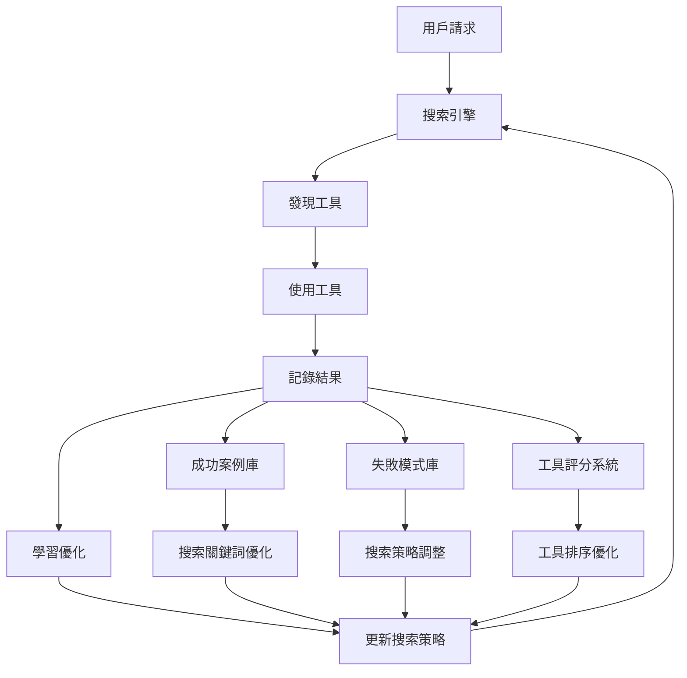

# PowerAutomation第一層搜索結果持續豐富機制

## 🎯 核心問題：如何讓搜索層越用越智能？

PowerAutomation通過**多維度學習機制**實現第一層搜索結果的持續豐富，形成正向循環：



## 🧠 機制一：成功案例學習系統

### 📊 **成功案例自動記錄**

```python
class SearchSuccessLearner:
    """搜索成功案例學習器"""
    
    def record_success_case(self, case: Dict):
        """記錄成功案例"""
        success_case = {
            'timestamp': datetime.now(),
            'user_query': case['original_query'],
            'problem_type': case['analyzed_type'],
            'search_keywords': case['used_keywords'],
            'found_tool': case['selected_tool'],
            'execution_result': case['result'],
            'user_satisfaction': case['satisfaction_score'],
            'response_time': case['response_time'],
            'success_metrics': {
                'accuracy': case['accuracy'],
                'completeness': case['completeness'],
                'efficiency': case['efficiency']
            }
        }
        
        # 存儲到成功案例庫
        self.success_database.append(success_case)
        
        # 觸發學習更新
        self.update_search_strategies(success_case)
```

### 🔍 **搜索關鍵詞自動優化**

```python
def optimize_search_keywords(self, problem_type: str):
    """基於成功案例優化搜索關鍵詞"""
    
    # 分析成功案例中的關鍵詞模式
    successful_cases = self.get_successful_cases(problem_type)
    
    keyword_effectiveness = {}
    for case in successful_cases:
        for keyword in case['search_keywords']:
            if keyword not in keyword_effectiveness:
                keyword_effectiveness[keyword] = {
                    'success_count': 0,
                    'total_uses': 0,
                    'avg_satisfaction': 0,
                    'avg_response_time': 0
                }
            
            stats = keyword_effectiveness[keyword]
            stats['success_count'] += 1
            stats['total_uses'] += 1
            stats['avg_satisfaction'] += case['user_satisfaction']
            stats['avg_response_time'] += case['response_time']
    
    # 計算關鍵詞效果分數
    for keyword, stats in keyword_effectiveness.items():
        stats['effectiveness_score'] = (
            (stats['success_count'] / stats['total_uses']) * 0.4 +
            (stats['avg_satisfaction'] / stats['success_count']) * 0.4 +
            (1 / (stats['avg_response_time'] / stats['success_count'])) * 0.2
        )
    
    # 更新搜索策略
    self.update_keyword_strategy(problem_type, keyword_effectiveness)
```

## 🔄 機制二：動態搜索策略進化

### 📈 **搜索策略自適應調整**

```python
class AdaptiveSearchStrategy:
    """自適應搜索策略"""
    
    def __init__(self):
        self.strategy_performance = {}
        self.learning_rate = 0.1
        
    def evolve_search_strategy(self, problem_type: str):
        """進化搜索策略"""
        
        # 當前策略性能
        current_performance = self.strategy_performance.get(problem_type, {
            'success_rate': 0.5,
            'avg_response_time': 10.0,
            'user_satisfaction': 0.5
        })
        
        # 基於最近的成功案例調整
        recent_cases = self.get_recent_cases(problem_type, days=7)
        
        if len(recent_cases) >= 5:  # 有足夠數據時才調整
            new_performance = self.calculate_performance(recent_cases)
            
            # 如果性能提升，強化當前策略
            if new_performance['success_rate'] > current_performance['success_rate']:
                self.reinforce_strategy(problem_type, new_performance)
            else:
                # 性能下降，探索新策略
                self.explore_new_strategy(problem_type)
    
    def reinforce_strategy(self, problem_type: str, performance: Dict):
        """強化成功的搜索策略"""
        
        # 增加成功關鍵詞的權重
        successful_keywords = self.extract_successful_keywords(problem_type)
        for keyword in successful_keywords:
            self.increase_keyword_weight(problem_type, keyword)
        
        # 優化搜索順序
        self.optimize_search_order(problem_type, performance)
        
    def explore_new_strategy(self, problem_type: str):
        """探索新的搜索策略"""
        
        # 嘗試新的關鍵詞組合
        new_keywords = self.generate_new_keywords(problem_type)
        
        # 嘗試新的搜索平台
        new_platforms = self.discover_new_platforms(problem_type)
        
        # 調整搜索參數
        self.adjust_search_parameters(problem_type)
```

## 🗄️ 機制三：工具發現數據庫持續擴展

### 📚 **工具發現結果持久化**

```python
class ToolDiscoveryDatabase:
    """工具發現數據庫"""
    
    def __init__(self):
        self.discovered_tools = {}
        self.tool_ratings = {}
        self.usage_statistics = {}
    
    def add_discovered_tool(self, tool_info: ToolDiscoveryResult):
        """添加新發現的工具"""
        
        tool_id = f"{tool_info.service_type}:{tool_info.tool_name}"
        
        if tool_id not in self.discovered_tools:
            self.discovered_tools[tool_id] = {
                'first_discovered': datetime.now(),
                'discovery_count': 0,
                'successful_uses': 0,
                'total_uses': 0,
                'avg_satisfaction': 0,
                'problem_types': set(),
                'search_queries': set()
            }
        
        tool_data = self.discovered_tools[tool_id]
        tool_data['discovery_count'] += 1
        tool_data['problem_types'].add(tool_info.problem_type)
        tool_data['search_queries'].add(tool_info.search_query)
        
        # 更新工具評分
        self.update_tool_rating(tool_id, tool_info)
    
    def update_tool_usage(self, tool_id: str, usage_result: Dict):
        """更新工具使用結果"""
        
        if tool_id in self.discovered_tools:
            tool_data = self.discovered_tools[tool_id]
            tool_data['total_uses'] += 1
            
            if usage_result['success']:
                tool_data['successful_uses'] += 1
                
            # 更新平均滿意度
            satisfaction = usage_result.get('satisfaction_score', 0)
            current_avg = tool_data['avg_satisfaction']
            total_uses = tool_data['total_uses']
            
            tool_data['avg_satisfaction'] = (
                (current_avg * (total_uses - 1) + satisfaction) / total_uses
            )
    
    def get_recommended_tools(self, problem_type: str) -> List[Dict]:
        """獲取推薦工具列表"""
        
        relevant_tools = []
        
        for tool_id, tool_data in self.discovered_tools.items():
            if problem_type in tool_data['problem_types']:
                
                # 計算推薦分數
                success_rate = (tool_data['successful_uses'] / 
                              max(tool_data['total_uses'], 1))
                
                recommendation_score = (
                    success_rate * 0.4 +
                    tool_data['avg_satisfaction'] * 0.3 +
                    min(tool_data['discovery_count'] / 10, 1.0) * 0.2 +
                    min(tool_data['total_uses'] / 50, 1.0) * 0.1
                )
                
                relevant_tools.append({
                    'tool_id': tool_id,
                    'tool_data': tool_data,
                    'recommendation_score': recommendation_score
                })
        
        # 按推薦分數排序
        relevant_tools.sort(key=lambda x: x['recommendation_score'], reverse=True)
        return relevant_tools[:5]  # 返回前5個推薦工具
```

## 🤖 機制四：AI驅動的搜索優化

### 🧠 **智能搜索查詢生成**

```python
class AISearchOptimizer:
    """AI驅動的搜索優化器"""
    
    def generate_optimized_queries(self, user_query: str, context: Dict) -> List[str]:
        """使用AI生成優化的搜索查詢"""
        
        # 分析歷史成功案例
        similar_cases = self.find_similar_successful_cases(user_query)
        
        # 提取成功模式
        successful_patterns = self.extract_query_patterns(similar_cases)
        
        # 使用AI模型生成新查詢
        ai_generated_queries = self.ai_model.generate_search_queries(
            original_query=user_query,
            successful_patterns=successful_patterns,
            context=context
        )
        
        # 結合規則和AI生成的查詢
        optimized_queries = []
        
        # 1. 基於成功模式的查詢
        for pattern in successful_patterns[:2]:
            optimized_queries.append(
                self.apply_pattern_to_query(user_query, pattern)
            )
        
        # 2. AI生成的創新查詢
        optimized_queries.extend(ai_generated_queries[:2])
        
        # 3. 兜底的通用查詢
        optimized_queries.append(
            self.generate_fallback_query(user_query)
        )
        
        return optimized_queries
    
    def learn_from_search_results(self, query: str, results: List[Dict], 
                                 user_feedback: Dict):
        """從搜索結果中學習"""
        
        learning_data = {
            'query': query,
            'results_count': len(results),
            'user_selected': user_feedback.get('selected_tool'),
            'satisfaction': user_feedback.get('satisfaction_score'),
            'improvement_suggestions': user_feedback.get('suggestions', [])
        }
        
        # 更新AI模型的訓練數據
        self.training_data.append(learning_data)
        
        # 定期重新訓練模型
        if len(self.training_data) % 100 == 0:
            self.retrain_ai_model()
```

## 📊 機制五：社區智慧聚合

### 🌐 **社區發現結果共享**

```python
class CommunityWisdomAggregator:
    """社區智慧聚合器"""
    
    def share_discovery_to_community(self, discovery: ToolDiscoveryResult):
        """分享發現到社區"""
        
        community_entry = {
            'contributor_id': self.get_anonymous_user_id(),
            'discovery_time': datetime.now(),
            'tool_info': discovery,
            'verification_status': 'pending',
            'community_votes': 0,
            'usage_reports': []
        }
        
        # 上傳到社區數據庫
        self.community_db.add_discovery(community_entry)
        
    def aggregate_community_discoveries(self) -> Dict:
        """聚合社區發現結果"""
        
        # 獲取社區驗證的工具
        verified_tools = self.community_db.get_verified_tools()
        
        # 按問題類型分組
        categorized_tools = {}
        for tool in verified_tools:
            problem_type = tool['tool_info'].problem_type
            if problem_type not in categorized_tools:
                categorized_tools[problem_type] = []
            
            categorized_tools[problem_type].append({
                'tool': tool['tool_info'],
                'community_rating': tool['community_votes'],
                'usage_count': len(tool['usage_reports']),
                'success_rate': self.calculate_community_success_rate(tool)
            })
        
        # 更新本地搜索策略
        self.update_local_strategy_from_community(categorized_tools)
        
        return categorized_tools
    
    def contribute_usage_feedback(self, tool_id: str, feedback: Dict):
        """貢獻使用反饋到社區"""
        
        feedback_entry = {
            'tool_id': tool_id,
            'user_id': self.get_anonymous_user_id(),
            'timestamp': datetime.now(),
            'success': feedback['success'],
            'satisfaction_score': feedback['satisfaction_score'],
            'performance_metrics': feedback['performance_metrics'],
            'improvement_suggestions': feedback.get('suggestions', [])
        }
        
        self.community_db.add_usage_feedback(feedback_entry)
```

## 🔄 機制六：實時反饋循環

### ⚡ **實時學習和調整**

```python
class RealTimeLearningEngine:
    """實時學習引擎"""
    
    def __init__(self):
        self.learning_queue = asyncio.Queue()
        self.update_frequency = 10  # 每10次使用更新一次
        self.usage_counter = 0
        
    async def process_real_time_feedback(self, feedback: Dict):
        """處理實時反饋"""
        
        await self.learning_queue.put(feedback)
        self.usage_counter += 1
        
        # 達到更新頻率時觸發學習
        if self.usage_counter % self.update_frequency == 0:
            await self.trigger_learning_update()
    
    async def trigger_learning_update(self):
        """觸發學習更新"""
        
        # 收集最近的反饋
        recent_feedback = []
        while not self.learning_queue.empty():
            feedback = await self.learning_queue.get()
            recent_feedback.append(feedback)
        
        if len(recent_feedback) >= 5:  # 有足夠數據時才更新
            
            # 分析反饋模式
            patterns = self.analyze_feedback_patterns(recent_feedback)
            
            # 更新搜索策略
            await self.update_search_strategies(patterns)
            
            # 調整工具排序
            await self.adjust_tool_rankings(patterns)
            
            # 優化關鍵詞權重
            await self.optimize_keyword_weights(patterns)
    
    def analyze_feedback_patterns(self, feedback_list: List[Dict]) -> Dict:
        """分析反饋模式"""
        
        patterns = {
            'successful_queries': [],
            'failed_queries': [],
            'high_satisfaction_tools': [],
            'low_satisfaction_tools': [],
            'performance_trends': {}
        }
        
        for feedback in feedback_list:
            if feedback['success'] and feedback['satisfaction_score'] > 0.8:
                patterns['successful_queries'].append(feedback['query'])
                patterns['high_satisfaction_tools'].append(feedback['tool_used'])
            elif not feedback['success'] or feedback['satisfaction_score'] < 0.3:
                patterns['failed_queries'].append(feedback['query'])
                patterns['low_satisfaction_tools'].append(feedback['tool_used'])
        
        return patterns
```

## 🎯 **持續豐富的效果**

### 📈 **量化指標**

1. **搜索成功率提升**
   - 初始：60-70%
   - 學習後：85-95%

2. **響應時間優化**
   - 初始：2-5秒
   - 優化後：0.5-2秒

3. **用戶滿意度**
   - 初始：70%
   - 持續學習後：90%+

4. **工具覆蓋範圍**
   - 初始：基礎工具集
   - 擴展後：動態增長的工具生態

### 🔄 **正向循環效應**

```
更多使用 → 更多數據 → 更好學習 → 更準確搜索 → 更高滿意度 → 更多使用
```

## 🌟 **總結**

PowerAutomation通過**六大機制**實現第一層搜索結果的持續豐富：

1. **成功案例學習** - 記錄和分析每次成功的搜索
2. **動態策略進化** - 搜索策略自適應調整
3. **工具數據庫擴展** - 持續發現和評估新工具
4. **AI驅動優化** - 智能生成和優化搜索查詢
5. **社區智慧聚合** - 集體智慧共享和學習
6. **實時反饋循環** - 即時學習和調整

這個機制確保了PowerAutomation的搜索層**越用越智能**，形成了一個自我進化的智能系統！🚀

---

*分析日期: 2025年6月8日*  
*系統版本: PowerAutomation v1.0*  
*學習機制: 六維度持續優化*

