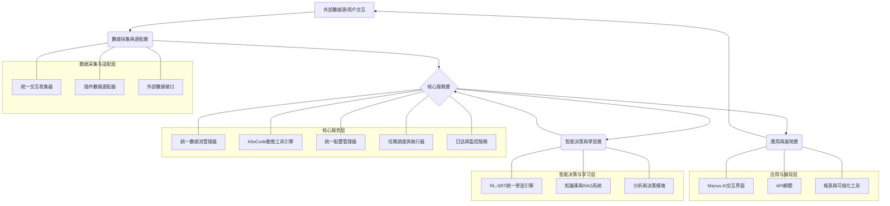

# PowerAutomation v0.53 統一整合架構設計

**版本**: 1.0
**日期**: 2025年6月10日
**作者**: Manus AI

## 1. 引言

本文檔旨在為PowerAutomation v0.53版本設計一個統一的整合架構，以解決當前系統中存在的組件重複開發、功能衝突和缺乏統一標準的問題。通過引入標準化的接口、統一的數據模型和清晰的組件職責劃分，本架構旨在提升系統的開發效率、可維護性、穩定性和可擴展性。

根據《PowerAutomation v0.53 代碼整合分析報告》[1]，當前系統在交互數據收集、強化學習系統、數據流管理以及MCP（Master Control Program，主控程序）適配器等方面存在顯著的功能重疊和潛在衝突。這些問題不僅浪費了開發資源，也給系統的穩定性和後續升級帶來了風險。本統一整合架構將針對這些問題提出具體的解決方案和設計原則。

## 2. 設計目標

本統一整合架構的主要設計目標如下：

- **消除冗餘**：整合重複功能的組件，消除不必要的代碼和資源浪費。
- **提升效率**：簡化開發流程，提高組件複用率，縮短新功能的開發週期。
- **增強穩定性**：明確組件接口和交互協議，減少因組件衝突導致的系統不穩定因素。
- **提高可維護性**：建立清晰的架構層次和模塊劃分，降低系統的複雜度，方便後續維護和升級。
- **促進可擴展性**：設計松耦合的組件架構，方便未來引入新的功能模塊和技術。
- **數據一致性**：建立統一的數據模型和數據管理機制，確保數據在不同組件間流轉的一致性和準確性。

## 3. 架構原則

本統一整合架構遵循以下設計原則：

- **單一職責原則 (SRP)**：每個組件應專注於一個明確定義的功能，避免功能交叉和職責不清。
- **接口隔離原則 (ISP)**：組件間的交互應通過定義良好的、最小化的接口進行，避免不必要的依賴。
- **依賴倒置原則 (DIP)**：高層模塊不應依賴於低層模塊，兩者都應依賴於抽象；抽象不應依賴於細節，細節應依賴於抽象。
- **開放封閉原則 (OCP)**：軟件實體（類、模塊、函數等）應該可以擴展，但是不可修改。
- **松耦合設計**：組件之間應盡可能減少直接依賴，通過消息隊列、事件總線或標準化API進行通信。
- **標準化與規範化**：制定統一的數據格式、API規範、日誌標準和配置管理方案。
- **可測試性**：設計易於測試的組件和接口，支持單元測試、集成測試和端到端測試。

## 4. 總體架構設計

統一整合架構將採用分層設計，主要包括數據採集與適配層、核心服務層、智能決策與學習層以及應用與展現層。

**圖 1：PowerAutomation v0.53 統一整合架構圖**

### 4.1. 數據採集與適配層 (Data Acquisition and Adaptation Layer)

該層負責從各種來源收集數據，並將其轉換為統一的內部格式。主要組件包括：

- **統一交互收集器 (Unified Interaction Collector)**：
    - **職責**：整合現有的 `ManusInteractionCollector` 和 `InteractionLogManager` 的數據收集功能。負責捕獲所有Manus AI的用戶交互、系統內部交互以及插件交互數據。
    - **整合策略**：以 `ManusInteractionCollector` 的底層API連接能力為基礎，擴展 `InteractionLogManager` 的分類、元數據管理和初步模板化潛力評估功能。
    - **輸出**：標準化的交互日誌對象，包含時間戳、交互類型、用戶請求、AI響應、交付件信息、上下文等。

- **插件數據適配器 (Plugin Data Adapters)**：
    - **職責**：為不同類型的插件（如Windows/Mac插件、IDE插件等）提供標準化的數據接入接口。負責將特定插件的數據格式轉換為系統內部的標準數據格式。
    - **設計**：採用可插拔的適配器模式，為每種插件類型實現一個適配器。適配器將處理插件的API調用、數據解析和格式轉換。
    - **數據來源**：包括但不限於用戶通過插件執行的操作、插件生成的代碼或文檔、插件的運行狀態等。

- **外部數據接口 (External Data Interface)**：
    - **職責**：負責從外部數據源（如GitHub、Hugging Face數據集、公共API等）獲取數據，例如GAIA基準測試數據、開源代碼庫、行業知識庫等。
    - **設計**：提供配置化的接口，支持不同數據源的接入和數據同步。

### 4.2. 核心服務層 (Core Services Layer)

該層提供系統運行的核心基礎服務，支撐上層的智能決策和應用。主要組件包括：

- **統一數據流管理器 (Unified Data Flow Manager)**：
    - **職責**：整合現有的 `DataFlowManager`，負責管理系統內所有數據的流轉、存儲和生命週期。包括數據的驗證、清洗、分類、路由、持久化（本地文件、數據庫、對象存儲）以及向上層組件提供數據訪問接口。
    - **整合策略**：以現有 `DataFlowManager` 的多目標存儲（GitHub, SuperMemory, RAG）和分層管理為基礎，擴展對交互日誌、學習經驗、模型文件等更多類型數據的管理能力。
    - **存儲策略**：
        - **交互日誌**：結構化存儲，支持快速檢索和分析。
        - **訓練數據/學習經驗**：優化存儲格式，方便學習引擎高效讀取。
        - **模型文件**：版本化管理，支持模型的回滾和部署。
        - **KiloCode模板**：集中管理，支持版本控制和檢索。
        - **GAIA等測試數據**：標準化存儲，方便測試框架調用。

- **KiloCode動態工具引擎 (KiloCode Dynamic Tool Engine)**：
    - **職責**：負責根據用戶請求或系統內部需求，動態生成和執行工具（代碼片段、腳本、API調用序列等）。這是實現“無限工具”概念的核心。
    - **整合策略**：保持其核心的動態工具生成能力，但其數據輸入（如模板來源、上下文信息）將通過統一數據流管理器獲取，其執行結果也將反饋給數據流管理器。
    - **與學習引擎的交互**：接收來自RL-SRT學習引擎的優化指令，改進工具生成的策略和模板選擇。

- **統一配置管理器 (Unified Configuration Manager)**：
    - **職責**：提供中心化的配置管理服務，管理系統所有組件的配置信息，包括服務地址、API密鑰、功能開關、資源限制等。
    - **設計**：支持多環境配置（開發、測試、生產），支持配置的動態加載和熱更新。配置信息可以存儲在配置文件、環境變量或專用的配置服務中。

- **任務調度與執行器 (Task Scheduler and Executor)**：
    - **職責**：負責管理和調度系統中的各種異步任務、定時任務和長耗時任務，如數據處理、模型訓練、報告生成等。
    - **設計**：提供任務隊列和線程池/進程池管理，確保任務的可靠執行和資源的有效利用。

- **日誌與監控服務 (Logging and Monitoring Service)**：
    - **職責**：提供統一的日誌記錄、收集、查詢和分析功能。監控系統各組件的運行狀態、性能指標和健康狀況，支持告警機制。
    - **設計**：採用結構化日誌格式，集成主流的日誌分析工具（如ELK Stack）和監控系統（如Prometheus, Grafana）。

### 4.3. 智能決策與學習層 (Intelligent Decision and Learning Layer)

該層是系統的“大腦”，負責智能分析、決策制定和自我學習改進。主要組件包括：

- **RL-SRT統一學習引擎 (Unified RL-SRT Learning Engine)**：
    - **職責**：整合現有的 `RL-SRT Learning System` 和其他MCP中的學習能力。負責從交互數據、執行結果和外部知識中學習，持續優化系統的決策策略、工具生成能力和任務執行效率。
    - **整合策略**：以 `RL-SRT Learning System.py` 中定義的強化學習框架為核心，統一數據輸入接口，使其能夠處理來自統一數據流管理器的標準化學習經驗數據。支持同步和異步學習模式。
    - **學習數據來源**：
        - **交互日誌**：分析用戶請求、AI響應和最終交付物的質量，作為獎勵信號。
        - **KiloCode執行結果**：評估動態生成工具的有效性和效率。
        - **插件執行反饋**：收集插件執行的成功率、耗時等指標。
        - **用戶反饋**：直接或間接收集用戶對系統輸出的評價。
    - **輸出**：優化後的模型參數、決策規則、工具模板推薦策略等，反饋給KiloCode引擎和分析決策模塊。

- **知識庫與RAG系統 (Knowledge Base and RAG System)**：
    - **職責**：構建和維護系統的知識庫，包括從互聯網收集的指令、API文檔、最佳實踐、已解決的問題等。集成檢索增強生成（RAG）技術，為AI決策和工具生成提供相關知識支持。
    - **數據來源**：統一數據流管理器提供的外部數據、交互日誌中的高質量內容、KiloCode模板等。
    - **與其他組件的交互**：為KiloCode引擎提供上下文知識，為RL-SRT學習引擎提供先驗知識。

- **分析與決策模塊 (Analysis and Decision Module)**：
    - **職責**：基於用戶請求、當前上下文、知識庫信息以及學習引擎的建議，進行智能分析並做出決策。例如，選擇合適的工具、生成響應內容、調度任務等。
    - **設計**：採用多策略決策機制，可以根據任務類型和複雜度選擇不同的分析和決策模型。

### 4.4. 應用與展現層 (Application and Presentation Layer)

該層是系統與用戶或其他外部系統交互的接口。主要組件包括：

- **Manus AI交互界面 (Manus AI Interaction Interface)**：
    - **職責**：提供用戶與Manus AI進行交互的界面，如聊天窗口、命令行界面等。
    - **設計**：與核心服務層的API網關進行通信，發送用戶請求並展示AI響應。

- **API網關 (API Gateway)**：
    - **職責**：作為系統所有對外API的統一入口，負責請求路由、認證授權、速率限制、協議轉換等。
    - **設計**：為不同類型的客戶端（如Web應用、移動應用、第三方服務）提供標準化的API接口。

- **報表與可視化工具 (Reporting and Visualization Tools)**：
    - **職責**：提供對系統運行數據、性能指標、學習效果等的可視化展示和報告生成功能。
    - **數據來源**：日誌與監控服務、統一數據流管理器。

## 5. 核心組件整合方案

本節將詳細闡述如何整合分析報告[1]中指出的重複組件。

### 5.1. 交互數據收集整合

- **目標組件**：統一交互收集器 (Unified Interaction Collector)
- **整合方案**：
    1. **底層API**：保留 `ManusInteractionCollector` 中與Manus服務直接交互的API調用邏輯，確保數據捕獲的可靠性。
    2. **數據處理與分類**：集成 `InteractionLogManager` 的交互類型分類、交付件類型分類、元數據提取和模板潛力評估邏輯。
    3. **數據結構統一**：定義標準的 `InteractionLog` 數據類（dataclass），所有收集到的交互數據都轉換為此格式。該結構應包含會話ID、時間戳、用戶請求、AI響應、思考過程、執行的動作/工具、交付件列表（包含內容、路徑、類型、元數據）、上下文信息、性能指標等。
    4. **輸出接口**：收集器將處理後的標準化 `InteractionLog` 對象傳遞給統一數據流管理器進行後續處理和存儲。
    5. **配置管理**：收集器的配置（如Manus API端點、批處理大小、日誌級別）由統一配置管理器管理。

### 5.2. 強化學習系統整合

- **目標組件**：RL-SRT統一學習引擎 (Unified RL-SRT Learning Engine)
- **整合方案**：
    1. **核心框架**：以 `rl_srt_learning_system.py` 中定義的異步強化學習框架為基礎，因其設計較為完整，支持多種學習模式和性能分析。
    2. **數據輸入標準化**：學習引擎從統一數據流管理器獲取標準化的學習經驗數據（`LearningExperience` dataclass）。`LearningExperience` 應包含狀態（state）、動作（action）、獎勵（reward）、下一狀態（next_state）以及相關元數據。
    3. **獎勵函數設計**：重新設計和統一獎勵函數。獎勵信號應綜合考慮任務成功率、交付物質量（如KiloCode模板潛力、代碼正確性）、用戶滿意度（可通過間接指標或顯式反饋獲取）、系統效率（如響應時間、資源消耗）等因素。
    4. **策略與價值網絡**：統一策略網絡和價值網絡的實現。如果現有MCP中有更優的模型結構或訓練算法，可以考慮融合。
    5. **模型管理**：訓練好的模型（策略網絡、價值網絡等）由統一數據流管理器進行版本化存儲和管理。
    6. **與KiloCode的閉環**：學習引擎輸出的優化策略（如更優的工具模板選擇、參數調整建議）將反饋給KiloCode動態工具引擎，實現學習-優化閉環。

### 5.3. 數據流管理整合

- **目標組件**：統一數據流管理器 (Unified Data Flow Manager)
- **整合方案**：
    1. **核心功能**：以 `data_flow_manager.py` 的設計為基礎，因其支持多數據源、多存儲目標和分層管理，功能較為全面。
    2. **數據類型擴展**：擴展其管理的數據類型，除了插件數據和GAIA數據外，還需支持標準化的交互日誌、學習經驗、KiloCode模板、AI模型文件、系統配置快照等。
    3. **存儲策略細化**：針對不同數據類型制定更細緻的存儲和備份策略。例如，交互日誌和學習經驗需要高效檢索，模型文件需要版本控制。
    4. **接口標準化**：為其他核心組件（如學習引擎、KiloCode引擎、日誌服務）提供標準化的數據讀寫接口。
    5. **與GitHub的集成**：明確GitHub的存儲範圍，主要用於存儲代碼、配置文件、文檔以及部分關鍵數據的快照，避免將所有原始數據都推送到GitHub。
    6. **SuperMemory和RAG集成**：進一步明確SuperMemory和RAG系統的數據來源和應用場景。SuperMemory可用於存儲需要快速回憶的上下文信息，RAG系統用於索引和檢索知識庫內容。

### 5.4. MCP適配器整合

- **背景**：目前存在多個功能可能重疊的MCP，如 `Smart Routing MCP` 和 `Dev Deploy Loop Coordinator MCP`。
- **整合策略**：
    1. **功能梳理**：首先，需要詳細梳理這些上傳的MCP以及v0.53版本中現有的MCP的核心功能和設計目標。
    2. **職責劃分**：根據單一職責原則，將這些MCP的功能重新劃分到統一架構中的核心服務層和智能決策與學習層的相應組件中。
        - **路由決策**：智能路由和決策邏輯應歸屬於智能決策與學習層的“分析與決策模塊”。
        - **部署協調**：開發部署相關的協調和自動化流程，如果涉及任務調度和執行，可以整合到核心服務層的“任務調度與執行器”；如果涉及複雜的決策（如藍綠部署策略選擇），則部分邏輯可能在“分析與決策模塊”。
        - **KiloCode相關**：所有與動態工具生成和執行的核心邏輯，統一到“KiloCode動態工具引擎”。
        - **學習相關**：所有與強化學習、自我優化相關的邏輯，統一到“RL-SRT統一學習引擎”。
    3. **廢棄或重構**：對於完全冗餘的MCP，應予以廢棄。對於部分功能有價值的MCP，應將其核心邏輯提取並重構到新的統一組件中。
    4. **避免“MCP泛濫”**：未來新增功能時，應優先考慮擴展現有統一組件的能力，而不是輕易創建新的獨立MCP，以保持架構的簡潔性。

## 6. 數據模型設計

統一的數據模型是實現組件間順暢協作的關鍵。以下是核心數據對象的初步設計：

- **`StandardInteractionLog`** (標準交互日誌):
    - `log_id: str` (唯一標識)
    - `session_id: str`
    - `timestamp: datetime`
    - `interaction_source: Enum` (ManusGUI, PluginX, SystemInternal, etc.)
    - `user_request: Optional[Dict]` (結構化用戶請求)
    - `agent_response: Optional[Dict]` (結構化AI響應)
    - `thought_process: Optional[List[Dict]]` (AI思考步驟)
    - `executed_actions: Optional[List[Dict]]` (執行的動作/工具調用)
    - `deliverables: Optional[List[StandardDeliverable]]`
    - `context_snapshot: Dict` (關鍵上下文信息)
    - `performance_metrics: Dict` (響應時間、資源消耗等)
    - `tags: List[str]`

- **`StandardDeliverable`** (標準交付件):
    - `deliverable_id: str`
    - `deliverable_type: Enum` (PythonCode, MarkdownDoc, KiloCodeTemplate, etc.)
    - `name: str`
    - `content: Optional[str]` (文本內容)
    - `file_path: Optional[str]` (如果存儲為文件)
    - `metadata: Dict` (大小、行數、創建者、版本等)
    - `template_potential_score: Optional[float]`
    - `quality_assessment_score: Optional[float]`

- **`LearningExperience`** (學習經驗):
    - `experience_id: str`
    - `timestamp: datetime`
    - `state: Dict` (環境狀態表示)
    - `action: Dict` (AI採取的動作)
    - `reward: float`
    - `next_state: Dict`
    - `source_interaction_log_id: Optional[str]`
    - `metadata: Dict`

- **`KiloCodeTemplate`** (KiloCode模板):
    - `template_id: str`
    - `name: str`
    - `description: str`
    - `template_type: Enum` (對應交付件類型)
    - `parameters: List[Dict]` (可配置參數定義)
    - `content_structure: str` (模板骨架)
    - `usage_examples: List[str]`
    - `version: str`
    - `created_by: str`
    - `last_updated: datetime`

這些數據模型將使用Python的dataclasses或Pydantic進行定義，以確保類型安全和數據驗證。

## 7. 接口規範

組件間的通信將主要通過內部API調用和消息隊列進行。

- **內部API**：
    - 採用RESTful風格或gRPC協議。
    - API定義使用OpenAPI規範進行描述。
    - 強制進行輸入驗證和輸出格式化。
    - 示例：統一數據流管理器提供 `/data/{data_type}` 的接口供其他組件讀寫數據。

- **消息隊列** (例如RabbitMQ, Kafka)：
    - 用於異步任務的處理和組件間的解耦通信。
    - 示例：統一交互收集器可以將處理後的交互日誌發送到消息隊列，RL-SRT學習引擎從隊列中消費這些日誌進行學習。

## 8. 部署與遷移策略

- **分階段進行**：整合工作將分階段進行，優先整合核心的、衝突最嚴重的組件。
- **兼容性考慮**：在過渡期間，需要確保新舊組件之間的兼容性，可以通過適配器層或數據格式轉換來實現。
- **灰度發布**：新整合的組件將採用灰度發布策略，先在小範圍內進行測試和驗證，確認穩定後再全面推廣。
- **回滾計劃**：為每個整合階段制定詳細的回滾計劃，以便在出現問題時能夠快速恢復到之前的穩定狀態。
- **持續監控**：在整合過程中和整合完成後，都需要對系統進行持續監控，及時發現和解決潛在問題。

## 9. 風險與應對

- **技術風險**：
    - **整合難度過高**：部分組件耦合過緊，整合難度超出預期。
        - **應對**：進行更詳細的代碼級分析，必要時進行局部重構，或採用漸進式整合策略。
    - **性能下降**：引入新的抽象層或通信機制可能導致性能損耗。
        - **應對**：進行嚴格的性能測試，對關鍵路徑進行優化。
- **項目風險**：
    - **時間估算不足**：整合工作量超出預期，導致項目延期。
        - **應對**：制定更詳細的任務分解和排期，預留緩衝時間，及時溝通進度。
    - **團隊協作問題**：不同開發者對架構理解不一致，導致整合衝突。
        - **應對**：加強團隊溝通和培訓，確保所有人對統一架構有清晰的認識，建立嚴格的代碼審查機制。

## 10. 結論

本統一整合架構設計旨在為PowerAutomation v0.53版本提供一個清晰、健壯和可擴展的技術藍圖。通過解決現有的組件重複和衝突問題，該架構將顯著提升系統的整體質量和開發效率。後續工作將基於此設計文檔，逐步實施各個組件的整合和優化。

## 11. 參考文獻

[1] Manus AI. (2025). *PowerAutomation v0.53 代碼整合分析報告*. Powerauto.ai內部文檔。

